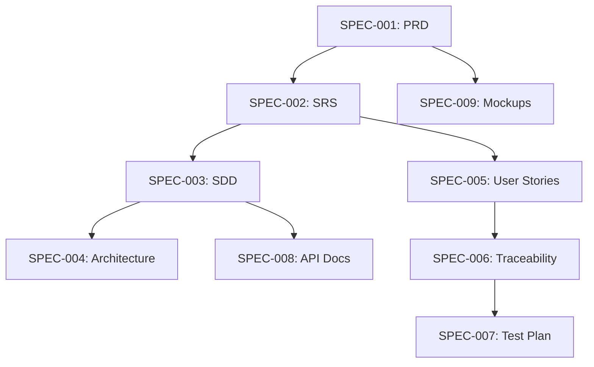
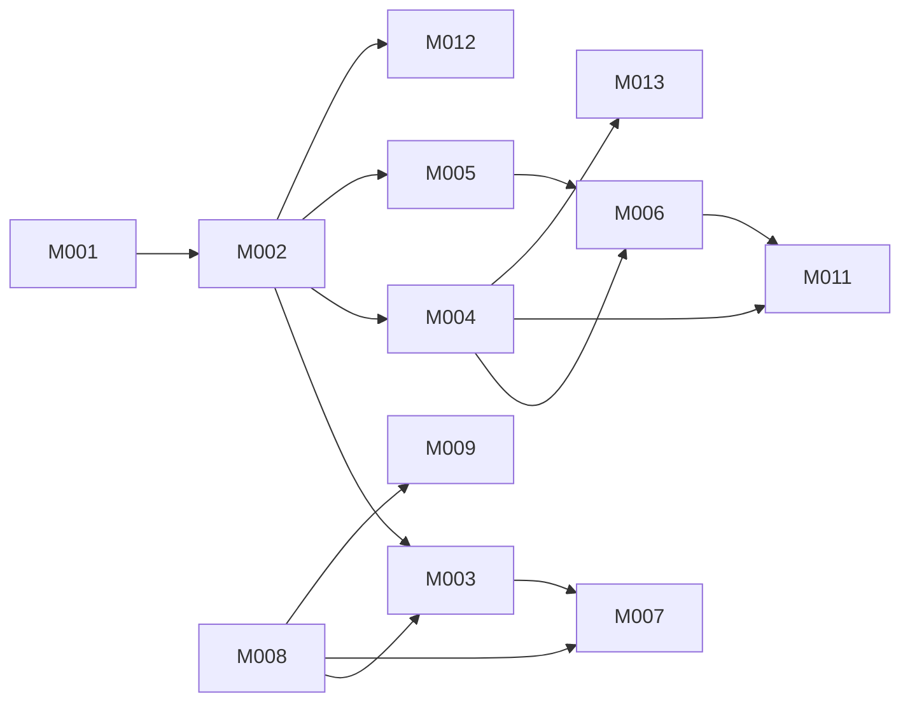

# DevDocAI v3.6.0 Master Reference Index

**Version:** 1.0.0  
**Date:** August 23, 2025  
**Purpose:** Master navigation index for all project documentation  
**Usage:** AI Agents should start here when looking for any document

---

## Quick Navigation Map

```
📁 /docs/
├── 📂 00-system/         [System Control - READ ONLY]
├── 📂 01-design-specs/   [Source of Truth - IMMUTABLE]
├── 📂 02-tracking/       [Progress Tracking - MUTABLE]
├── 📂 03-working/        [Active Development - MUTABLE]
└── 📂 04-reference/      [Quick Lookups - APPEND ONLY]
```

---

## 1. System Control Documents [L0]

| Document ID | File Path | Purpose | Status |
|-------------|-----------|---------|--------|
| `SYS-001` | `/00-system/AI-AGENT-FILING-SYSTEM.md` | Master filing system design | ACTIVE |
| `SYS-002` | `/00-system/AI-AGENT-INSTRUCTIONS.md` | AI agent operational guidelines | ACTIVE |
| `SYS-003` | `/00-system/DATA-INTEGRITY-RULES.md` | Validation and consistency rules | ACTIVE |
| `SYS-004` | `/00-system/REFERENCE-INDEX.md` | This document - master index | ACTIVE |

---

## 2. Design Specifications [L1] - IMMUTABLE

| Document ID | File Path | Purpose | Key Sections |
|-------------|-----------|---------|--------------|
| `SPEC-001` | `/01-design-specs/DESIGN-devdocai-prd.md` | Product Requirements Document | Vision, Features, User Needs |
| `SPEC-002` | `/01-design-specs/DESIGN-devdocai-srs.md` | Software Requirements Specification | FR-001 to FR-030, NFR-001 to NFR-015 |
| `SPEC-003` | `/01-design-specs/DESIGN-devdocsai-sdd.md` | Software Design Document | Module M001-M013 specifications |
| `SPEC-004` | `/01-design-specs/DESIGN-devdocsai-architecture.md` | System Architecture | Components, Interfaces, Data Flow |
| `SPEC-005` | `/01-design-specs/DESIGN-devdocsai-user-stories.md` | User Stories | US-001 to US-030 with acceptance criteria |
| `SPEC-006` | `/01-design-specs/DESIGN-devdocsai-traceability-matrix.md` | Requirements Traceability | Requirement → Module → Test mapping |
| `SPEC-007` | `/01-design-specs/DESIGN-devdocai-test-plan.md` | Test Plan | TC-001 to TC-050, test strategies |
| `SPEC-008` | `/01-design-specs/DESIGN-devdocai-api-documentation.md` | API Specifications | Endpoints, schemas, examples |
| `SPEC-009` | `/01-design-specs/DESIGN-devdocai-mockups.md` | UI/UX Mockups | Wireframes, user flows |
| `SPEC-010` | `/01-design-specs/DESIGN-devdocsai-scmp.md` | Configuration Management Plan | Version control, build process |
| `SPEC-011` | `/01-design-specs/DESIGN-devdocai-build-instructions.md` | Build Instructions | Setup, compilation, packaging |
| `SPEC-012` | `/01-design-specs/DESIGN-devdocai-deployment-installation-guide.md` | Deployment Guide | Installation, configuration |
| `SPEC-013` | `/01-design-specs/DESIGN-devdocai-maintenance-plan.md` | Maintenance Plan | Support, updates, monitoring |
| `SPEC-014` | `/01-design-specs/DESIGN-devdocai-user-docs.md` | User Documentation | Guides, tutorials |
| `SPEC-015` | `/01-design-specs/DESIGN-devdocai-user-manual.md` | User Manual | Complete reference |

---

## 3. Module Quick Reference

| Module ID | Module Name | Primary Spec | Dependencies | Priority | Tracking File |
|-----------|-------------|--------------|--------------|----------|---------------|
| `M001` | Configuration Manager | [SPEC-003#M001] | None | P0 | `/02-tracking/module-progress/M001-config-manager.tracking.md` |
| `M002` | Local Storage System | [SPEC-003#M002] | M001 | P0 | `/02-tracking/module-progress/M002-storage-system.tracking.md` |
| `M003` | MIAIR Engine | [SPEC-003#M003] | M002, M008 | P1 | `/02-tracking/module-progress/M003-miair-engine.tracking.md` |
| `M004` | Document Generator | [SPEC-003#M004] | M002, M008 | P0 | `/02-tracking/module-progress/M004-document-generator.tracking.md` |
| `M005` | Tracking Matrix | [SPEC-003#M005] | M002 | P0 | `/02-tracking/module-progress/M005-tracking-matrix.tracking.md` |
| `M006` | Suite Manager | [SPEC-003#M006] | M004, M005 | P0 | `/02-tracking/module-progress/M006-suite-manager.tracking.md` |
| `M007` | Review Engine | [SPEC-003#M007] | M003, M008 | P0 | `/02-tracking/module-progress/M007-review-engine.tracking.md` |
| `M008` | LLM Adapter | [SPEC-003#M008] | M001 | P1 | `/02-tracking/module-progress/M008-llm-adapter.tracking.md` |
| `M009` | Enhancement Pipeline | [SPEC-003#M009] | M003, M008 | P1 | `/02-tracking/module-progress/M009-enhancement-pipeline.tracking.md` |
| `M010` | SBOM Generator | [SPEC-003#M010] | M002 | P2 | `/02-tracking/module-progress/M010-sbom-generator.tracking.md` |
| `M011` | Batch Operations | [SPEC-003#M011] | M004, M006 | P1 | `/02-tracking/module-progress/M011-batch-operations.tracking.md` |
| `M012` | Version Control | [SPEC-003#M012] | M002 | P1 | `/02-tracking/module-progress/M012-version-control.tracking.md` |
| `M013` | Template Marketplace | [SPEC-003#M013] | M004 | P2 | `/02-tracking/module-progress/M013-template-marketplace.tracking.md` |

---

## 4. Requirement Categories

### Functional Requirements (FR)

| ID Range | Category | Specification Location |
|----------|----------|------------------------|
| FR-001 to FR-005 | Document Generation | [SPEC-002#FR-001-005] |
| FR-006 to FR-010 | Review & Validation | [SPEC-002#FR-006-010] |
| FR-011 to FR-015 | Suite Management | [SPEC-002#FR-011-015] |
| FR-016 to FR-020 | AI Enhancement | [SPEC-002#FR-016-020] |
| FR-021 to FR-025 | Integration | [SPEC-002#FR-021-025] |
| FR-026 to FR-030 | Marketplace | [SPEC-002#FR-026-030] |

### Non-Functional Requirements (NFR)

| ID Range | Category | Specification Location |
|----------|----------|------------------------|
| NFR-001 to NFR-003 | Performance | [SPEC-002#NFR-001-003] |
| NFR-004 to NFR-006 | Security | [SPEC-002#NFR-004-006] |
| NFR-007 to NFR-009 | Usability | [SPEC-002#NFR-007-009] |
| NFR-010 to NFR-012 | Reliability | [SPEC-002#NFR-010-012] |
| NFR-013 to NFR-015 | Maintainability | [SPEC-002#NFR-013-015] |

---

## 5. Test Case Mapping

| Test Range | Module Coverage | Requirement Coverage | Location |
|------------|-----------------|---------------------|----------|
| TC-001-010 | M001, M002 | FR-001-005 | [SPEC-007#TC-001-010] |
| TC-011-020 | M003, M004 | FR-006-010 | [SPEC-007#TC-011-020] |
| TC-021-030 | M005, M006 | FR-011-015 | [SPEC-007#TC-021-030] |
| TC-031-040 | M007, M008 | FR-016-020 | [SPEC-007#TC-031-040] |
| TC-041-050 | M009-M013 | FR-021-030 | [SPEC-007#TC-041-050] |

---

## 6. Tracking Documents [L2]

| Document Type | Location | Update Frequency | Purpose |
|---------------|----------|------------------|---------|
| Master Tracker | `/02-tracking/implementation-status-tracker.md` | Per task | Overall progress |
| Module Tracking | `/02-tracking/module-progress/*.tracking.md` | Per component | Module-specific progress |
| Daily Progress | `/02-tracking/daily-progress/YYYY-MM-DD-progress.md` | Daily | Daily accomplishments |
| Decision Log | `/02-tracking/decision-log/ADR-*.md` | Per decision | Architecture decisions |

---

## 7. Working Documents [L3]

| Document Type | Location | Purpose | Update Rules |
|---------------|----------|---------|--------------|
| Sprint Plan | `/03-working/current-sprint/sprint-plan.md` | Active tasks | Update at sprint start |
| Blockers | `/03-working/current-sprint/blockers.md` | Current impediments | Update when blocked |
| Dependencies | `/03-working/current-sprint/dependencies.md` | Dependency tracking | Update on changes |
| Integration Notes | `/03-working/integration-notes/module-interfaces.md` | Interface documentation | Update on integration |
| Validation Reports | `/03-working/validation-reports/YYYY-MM-DD-validation.md` | Test results | After each test run |

---

## 8. Reference Documents [L4]

| Document | Location | Purpose | When to Use |
|----------|----------|---------|-------------|
| Dependency Graph | `/04-reference/module-dependency-graph.md` | Visual dependencies | Planning implementation order |
| API Registry | `/04-reference/api-endpoint-registry.md` | All API endpoints | Integration work |
| Error Registry | `/04-reference/error-code-registry.md` | Error codes and handling | Error implementation |
| Glossary | `/04-reference/glossary.md` | Term definitions | Understanding domain |

---

## 9. Document Access Patterns

### For Requirements Implementation

```
1. Start: REFERENCE-INDEX.md (this document)
2. Read: SPEC-002 (SRS) for requirement details
3. Read: SPEC-006 (Traceability) for module mapping
4. Read: SPEC-003 (SDD) for module design
5. Check: /02-tracking/module-progress/ for current status
6. Update: Module tracking file after implementation
```

### For Module Development

```
1. Start: Module ID (M###) from this index
2. Read: SPEC-003#M### for design specification
3. Check: Module dependency graph for prerequisites
4. Read: Related test cases from SPEC-007
5. Track: Update progress in module tracking file
```

### For Testing

```
1. Start: Test case ID (TC-###)
2. Read: SPEC-007 for test specification
3. Check: SPEC-006 for requirement mapping
4. Verify: Implementation in module code
5. Report: Results in validation reports
```

---

## 10. Key Relationships

### Document Dependencies



### Module Dependencies



---

## 11. Quick Search Patterns

### Find Requirement

```bash
# Find functional requirement
grep "FR-001" docs/01-design-specs/DESIGN-devdocai-srs.md

# Find all references to requirement
grep -r "\[SRC:.*FR-001\]" docs/
```

### Find Module Information

```bash
# Find module specification
grep -A 50 "## M001" docs/01-design-specs/DESIGN-devdocsai-sdd.md

# Check module progress
cat docs/02-tracking/module-progress/M001-*.tracking.md
```

### Find Test Cases

```bash
# Find test specification
grep "TC-001" docs/01-design-specs/DESIGN-devdocai-test-plan.md

# Find test implementation
grep -r "\[TEST:TC-001\]" src/
```

---

## 12. Document Checksums (Immutable Documents)

| Document | SHA-256 Checksum | Last Verified |
|----------|------------------|---------------|
| SPEC-001 | `[CHECKSUM-TO-BE-CALCULATED]` | 2025-08-23 |
| SPEC-002 | `[CHECKSUM-TO-BE-CALCULATED]` | 2025-08-23 |
| SPEC-003 | `[CHECKSUM-TO-BE-CALCULATED]` | 2025-08-23 |
| SPEC-004 | `[CHECKSUM-TO-BE-CALCULATED]` | 2025-08-23 |
| SPEC-005 | `[CHECKSUM-TO-BE-CALCULATED]` | 2025-08-23 |
| SPEC-006 | `[CHECKSUM-TO-BE-CALCULATED]` | 2025-08-23 |
| SPEC-007 | `[CHECKSUM-TO-BE-CALCULATED]` | 2025-08-23 |
| SPEC-008 | `[CHECKSUM-TO-BE-CALCULATED]` | 2025-08-23 |
| SPEC-009 | `[CHECKSUM-TO-BE-CALCULATED]` | 2025-08-23 |
| SPEC-010 | `[CHECKSUM-TO-BE-CALCULATED]` | 2025-08-23 |
| SPEC-011 | `[CHECKSUM-TO-BE-CALCULATED]` | 2025-08-23 |
| SPEC-012 | `[CHECKSUM-TO-BE-CALCULATED]` | 2025-08-23 |
| SPEC-013 | `[CHECKSUM-TO-BE-CALCULATED]` | 2025-08-23 |
| SPEC-014 | `[CHECKSUM-TO-BE-CALCULATED]` | 2025-08-23 |
| SPEC-015 | `[CHECKSUM-TO-BE-CALCULATED]` | 2025-08-23 |

---

## Navigation Tips for AI Agents

1. **Always start here** when looking for any document
2. **Use Document IDs** (e.g., SPEC-001, M001) for precise references
3. **Follow the hierarchy**: System → Design → Tracking → Working → Reference
4. **Check dependencies** before starting module work
5. **Verify checksums** before reading immutable documents
6. **Update tracking** immediately after completing tasks
7. **Cross-reference** using the notation system [TYPE:ID#SECTION]

---

*End of Reference Index - Last Updated: 2025-08-23*