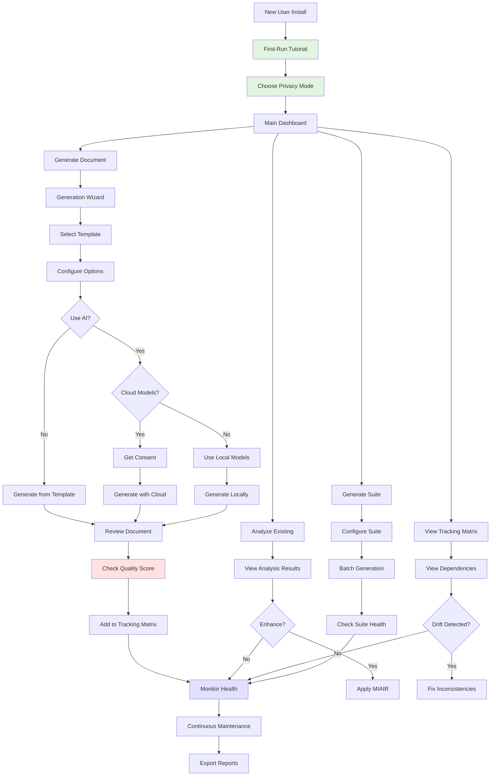

<updated_mockups_wireframes>

# DevDocAI v3.5.0 Mockups and Wireframes - Complete Update

## 1. Introduction

### Overview of the Update Process

This comprehensive update addresses all requirements identified in ChatGPT-5's review while maintaining alignment with DevDocAI v3.5.0's complete documentation suite. The updates prioritize user experience, accessibility (WCAG 2.1 AA compliance), and clarity through enhanced onboarding, contextual help, and standardized terminology.

### Summary of Major Changes

- **Added First-Run Onboarding**: New tutorial screens guide users through key features
- **Enhanced Tooltips & Help**: Every complex metric now includes plain-language explanations
- **Standardized Terminology**: Consistent naming across all interfaces ("Generate Suite", "Suite Analysis", "Suite Health")
- **Improved Accessibility**: Added keyboard navigation indicators, ARIA labels, and high-contrast toggle
- **New Error State Mockups**: Complete error handling and recovery workflows
- **Simplified Privacy Settings**: Clearer language for privacy modes
- **Added License Management**: New view for SBOM and license tracking
- **Enhanced Visual Clarity**: Improved labeling, hints, and interaction indicators

## 2. Updated Wireframes

### Mockup 1: First-Run Onboarding (NEW)

**Screen/Component Name**: DevDocAI Welcome & Tutorial

**Purpose**: Guide new users through key features with interactive walkthrough

**Key Elements**:

```
┌─────────────────────────────────────────────────────────────────────┐
│  Welcome to DevDocAI v3.5.0 - Your Documentation Assistant    [Skip]│
├─────────────────────────────────────────────────────────────────────┤
│                                                                      │
│                    🚀 Let's Get You Started!                        │
│                                                                      │
│  ┌──────────────────────────────────────────────────────────────┐  │
│  │                                                              │  │
│  │     📝 Generate              🔍 Analyze                     │  │
│  │     Professional            Document                        │  │
│  │     Documentation           Quality                         │  │
│  │                                                              │  │
│  │     🔄 Track                 🔒 Privacy                      │  │
│  │     Dependencies            First                           │  │
│  │     & Consistency           Design                          │  │
│  │                                                              │  │
│  └──────────────────────────────────────────────────────────────┘  │
│                                                                      │
│  What is Health Score? 💡                                           │
│  ┌──────────────────────────────────────────────────────────────┐  │
│  │ Health Score = Quality + Consistency + Completeness          │  │
│  │                                                              │  │
│  │ • 85%+ = Professional documentation ✅                       │  │
│  │ • 70-84% = Good, needs some improvements 📝                  │  │
│  │ • Below 70% = Requires attention ⚠️                          │  │
│  │                                                              │  │
│  │ We calculate this automatically for every document!          │  │
│  └──────────────────────────────────────────────────────────────┘  │
│                                                                      │
│  Quick Setup (Step 1 of 3)                                          │
│  ┌──────────────────────────────────────────────────────────────┐  │
│  │ Choose Your Privacy Mode:                                    │  │
│  │                                                              │  │
│  │ (●) Local Only - Everything stays on your computer          │  │
│  │ ( ) Local + Manual Cloud - You control when to use AI       │  │
│  │ ( ) Smart Mode - Automatic optimization with your consent   │  │
│  │                                                              │  │
│  │ ℹ️ You can change this anytime in Settings                   │  │
│  └──────────────────────────────────────────────────────────────┘  │
│                                                                      │
│  [← Back] [Next: Learn Key Features →]           Step 1 of 3        │
│                                                                      │
└─────────────────────────────────────────────────────────────────────┘
```

**Explanation of Changes**:

- Addresses the need for onboarding and first-run walkthrough
- Provides plain-language explanation of Health Score metric
- Simplifies privacy mode selection with clearer descriptions
- Implements progressive disclosure with step-by-step setup

**How it addresses requirements**:

- Reduces confusion about Health % metric (Requirements Review)
- Provides simplified privacy setting language (Usability Review)
- Aligns with PRD's "simplified onboarding" requirement

### Mockup 2: VS Code Extension - Enhanced Main View

**Screen/Component Name**: DevDocAI VS Code Extension Main Panel (Enhanced)

**Purpose**: Primary interface with improved tooltips, hints, and accessibility features

**Key Elements**:

```
┌─────────────────────────────────────────────────────────────────────┐
│  DevDocAI v3.5.0 - Documentation Hub                    [−][□][×]   │
│  [Keyboard: Alt+D for menu] [🌙/☀️ Theme] [♿ Accessibility]         │
├─────────────────────────────────────────────────────────────────────┤
│                                                                      │
│  📁 Project: MyWebApp      🔒 Local Mode ✓      [? Help]           │
│  ────────────────────────────────────────────────────────────────  │
│                                                                      │
│  Quick Actions (Press Tab to navigate)                              │
│  ┌─────────────────┐ ┌─────────────────┐ ┌─────────────────┐     │
│  │ 📝 Generate     │ │ 📊 Analyze      │ │ 🔄 View         │     │
│  │   Document      │ │   Current       │ │   Tracking      │     │
│  │ [Alt+G]         │ │ [Alt+A]         │ │   Matrix        │     │
│  └─────────────────┘ └─────────────────┘ │ [Alt+M]         │     │
│  ┌─────────────────┐                      └─────────────────┘     │
│  │ 📦 Generate     │                                               │
│  │   Suite         │  💡 Tip: Click any button or use keyboard    │
│  │ [Alt+S]         │      shortcuts shown in brackets             │
│  └─────────────────┘                                               │
│                                                                      │
│  Document Explorer              Overall Health: 87% ⓘ              │
│  ┌────────────────────────────────────────────────────────────┐    │
│  │ 📂 /docs (Click files to open, right-click for options)    │    │
│  │   ├─ 📄 README.md          ✓ 92% │ Current    [View]       │    │
│  │   │                              │ ⓘ Health = Quality +    │    │
│  │   │                              │   Consistency +         │    │
│  │   ├─ 📄 SRS.md             ⚠ 78% │ Needs Review           │    │
│  │   │                              │ ⓘ Click to see what    │    │
│  │   │                              │   needs improvement    │    │
│  │   ├─ 📄 architecture.md    ✓ 89% │ Current                │    │
│  │   ├─ 📄 test-plan.md       ⚠ 72% │ Outdated ⓘ            │    │
│  │   │                              │ This document hasn't   │    │
│  │   │                              │ been updated in sync  │    │
│  │   │                              │ with related docs     │    │
│  │   └─ 📄 deployment.md      ✓ 95% │ Current                │    │
│  └────────────────────────────────────────────────────────────┘    │
│                                                                      │
│  Recent Activity & Notifications                                    │
│  ┌────────────────────────────────────────────────────────────┐    │
│  │ 14:32  ✅ Generated: API Documentation                      │    │
│  │ 14:28  ✨ Enhanced: README.md (78% → 92% health)          │    │
│  │ 14:15  ⚠️ Drift Alert: test-plan.md is out of sync         │    │
│  │        💡 Suggestion: Update test-plan.md to match SRS     │    │
│  │ 13:58  📊 Suite Check: 2 documents need review [Fix Now]   │    │
│  └────────────────────────────────────────────────────────────┘    │
│                                                                      │
│  [Generate New] [Analyze All] [View Matrix] [Settings] [? Tutorial]│
│                                                                      │
└─────────────────────────────────────────────────────────────────────┘
```

**Explanation of Changes**:

- Added keyboard navigation hints (Alt+key shortcuts)
- Added accessibility toggle and theme switcher
- Added contextual tooltips (ⓘ icons) explaining metrics
- Clear hints for clickable elements ("Click files to open")
- Added actionable suggestions in activity feed
- Added tutorial button for quick access to help

**How it addresses requirements**:

- US-018: Accessibility features with keyboard navigation
- Tooltips explain Health Score components (Requirements Review)
- Clear interaction hints prevent confusion (Usability Review)

### Mockup 3: Document Generation Wizard - Enhanced

**Screen/Component Name**: Document Generation Interface with Improved Clarity

**Purpose**: Guide document creation with better terminology and help text

**Key Elements**:

```
┌─────────────────────────────────────────────────────────────────────┐
│  DevDocAI - Generate New Document                     Step 1 of 3   │
│  Need help? Press F1 or click [? Help] at any time                  │
├─────────────────────────────────────────────────────────────────────┤
│                                                                      │
│  Select Document Type(s) - You can choose multiple!                 │
│  ────────────────────────────────────────────────────────────────  │
│                                                                      │
│  📋 Planning & Requirements          📐 Design & Architecture       │
│  ┌──────────────────────────┐       ┌──────────────────────────┐  │
│  │ □ Project Plan           │       │ □ Software Design Doc    │  │
│  │ □ Work Breakdown (WBS)   │       │ □ Architecture Blueprint │  │
│  │ ☑ Software Requirements  │       │ □ API Specifications     │  │
│  │   (SRS) ⓘ               │       │ □ Database Schema        │  │
│  │ □ Product Requirements   │       │ □ UML Diagrams           │  │
│  │   (PRD) ⓘ               │       │ □ Mockups/Wireframes     │  │
│  │ □ User Stories           │       │                          │  │
│  └──────────────────────────┘       └──────────────────────────┘  │
│                                                                      │
│  ┌──────────────────────────────────────────────────────────────┐  │
│  │ ⓘ What's the difference between SRS and PRD?                │  │
│  │ • PRD: Business requirements (what to build and why)        │  │
│  │ • SRS: Technical requirements (how to build it)             │  │
│  └──────────────────────────────────────────────────────────────┘  │
│                                                                      │
│  Generation Options:                                                │
│  ┌──────────────────────────────────────────────────────────────┐  │
│  │ [×] Use AI Enhancement                                       │  │
│  │     └─ ⓘ Uses MIAIR to improve quality by 60-75%            │  │
│  │                                                              │  │
│  │ [×] Add to Tracking Matrix                                  │  │
│  │     └─ ⓘ Automatically tracks relationships & versions      │  │
│  │                                                              │  │
│  │ [ ] Generate Complete Suite                                 │  │
│  │     └─ ⓘ Creates all related documents at once              │  │
│  │                                                              │  │
│  │ AI Model Selection (when AI Enhancement is enabled):        │  │
│  │ (●) Local Models (Privacy-first, no internet needed)        │  │
│  │ ( ) Cloud Models (Better quality, requires API keys)        │  │
│  │     └─ Claude (40%) + ChatGPT (35%) + Gemini (25%)         │  │
│  └──────────────────────────────────────────────────────────────┘  │
│                                                                      │
│  Estimated time: ~30 seconds per document                          │
│                                                                      │
│  [← Back] [Skip Wizard] [Next: Configure Templates →]              │
│                                                                      │
└─────────────────────────────────────────────────────────────────────┘
```

**Explanation of Changes**:

- Added contextual help explaining document types
- Clarified AI model selection and transparency
- Added time estimates for user expectations
- Explained each option with tooltips
- Shows AI model distribution when cloud is selected

**How it addresses requirements**:

- Transparency about which AI models are used (Usability Review)
- Clear explanations reduce confusion (Requirements Review)
- Aligns with US-001 and US-009 requirements

### Mockup 4: Document Tracking Matrix - Enhanced

**Screen/Component Name**: Tracking Matrix with Improved Clarity

**Purpose**: Visual dependency tracking with better labeling and interaction hints

**Key Elements**:

```
┌─────────────────────────────────────────────────────────────────────┐
│  Document Tracking Matrix - Project: MyWebApp          🔄 Refresh   │
│  [? What is this?] Click any node to see details • Drag to pan      │
├─────────────────────────────────────────────────────────────────────┤
│                                                                      │
│  Interactive Dependency Graph        Suite Consistency: 87% ⓘ       │
│  ┌────────────────────────────────────────────────────────────┐    │
│  │ 💡 Hover over connections to see relationship types         │    │
│  │    Click nodes for details • Right-click for actions       │    │
│  │                                                             │    │
│  │                      [PRD v3.0] 🟢                          │    │
│  │                     (Click to view)                         │    │
│  │                          ↓                                  │    │
│  │                    "defines requirements for"               │    │
│  │              ┌──────────┴──────────┐                       │    │
│  │              ↓                      ↓                       │    │
│  │         [SRS v2.8] 🟡          [User Stories v2.1] 🟢      │    │
│  │         "implements"           "implements"                │    │
│  │              ↓                      ↓                       │    │
│  │      ┌───────┴────────┐    ┌───────┴────────┐             │    │
│  │      ↓                ↓    ↓                ↓             │    │
│  │  [SDD v2.5] 🟢   [Test Plan v1.2] 🔴   [API Spec v2.0] 🟢 │    │
│  │                                                             │    │
│  │  Legend: 🟢 In Sync  🟡 Minor Drift  🔴 Needs Update       │    │
│  └────────────────────────────────────────────────────────────┘    │
│                                                                      │
│  What Does This Mean? ⓘ                                             │
│  ┌────────────────────────────────────────────────────────────┐    │
│  │ • Arrows show which documents depend on others              │    │
│  │ • Colors indicate if documents are synchronized             │    │
│  │ • Red documents are outdated and need your attention        │    │
│  │ • Click any document to see what needs updating             │    │
│  └────────────────────────────────────────────────────────────┘    │
│                                                                      │
│  Drift Alerts - Action Required                                     │
│  ┌────────────────────────────────────────────────────────────┐    │
│  │ ⚠️ test-plan.md is 2 versions behind SRS.md                │    │
│  │    What this means: Test plan doesn't reflect latest       │    │
│  │    requirements. Tests may be missing or incorrect.         │    │
│  │    [Fix Now] [View Differences] [Ignore]                   │    │
│  │                                                             │    │
│  │ ⚠️ deployment.md references outdated api-spec.md v1.8       │    │
│  │    Impact: Deployment instructions may fail                 │    │
│  │    [Update References] [View Details]                       │    │
│  └────────────────────────────────────────────────────────────┘    │
│                                                                      │
│  Impact Analysis (What happens if you change SRS.md?)              │
│  ┌────────────────────────────────────────────────────────────┐    │
│  │ These documents will need updates:                          │    │
│  │ • SDD.md - High impact (design must match requirements)     │    │
│  │ • test-plan.md - High impact (tests validate requirements) │    │
│  │ • api-spec.md - Medium impact (may need endpoint changes)  │    │
│  │ • deployment.md - Low impact (minor config updates)        │    │
│  │                                                             │    │
│  │ Estimated total effort: 4-6 hours                          │    │
│  │ [Start Guided Update] [Export Impact Report]               │    │
│  └────────────────────────────────────────────────────────────┘    │
│                                                                      │
│  [Run Consistency Check] [Fix All Drift] [Export Report] [Settings]│
│                                                                      │
└─────────────────────────────────────────────────────────────────────┘
```

**Explanation of Changes**:

- Added clear interaction hints at the top
- Added legend for color coding
- Added plain-language explanations for drift alerts
- Labeled relationship arrows for clarity
- Added "What Does This Mean?" help section
- Actionable buttons for each alert

**How it addresses requirements**:

- Addresses dense graph confusion (Requirements Review)
- Provides onboarding hints (Usability Review)
- Clear labeling of dependencies (US-002)

### Mockup 5: Error State Handling (NEW)

**Screen/Component Name**: Error States and Recovery Workflows

**Purpose**: Clear error communication with actionable recovery options

**Key Elements**:

```
┌─────────────────────────────────────────────────────────────────────┐
│  DevDocAI - Error Recovery Assistant                                │
├─────────────────────────────────────────────────────────────────────┤
│                                                                      │
│  ⚠️ Document Generation Failed                                       │
│  ────────────────────────────────────────────────────────────────  │
│                                                                      │
│  What Happened:                                                     │
│  ┌──────────────────────────────────────────────────────────────┐  │
│  │ Unable to generate SRS.md using cloud AI models               │  │
│  │                                                               │  │
│  │ Error Details:                                                │  │
│  │ • API rate limit exceeded for ChatGPT                        │  │
│  │ • Occurred at: 14:32:15                                       │  │
│  │ • Error Code: API_RATE_LIMIT_429                             │  │
│  └──────────────────────────────────────────────────────────────┘  │
│                                                                      │
│  How to Fix This:                                                   │
│  ┌──────────────────────────────────────────────────────────────┐  │
│  │ Option 1: Use Local Models (Recommended)                      │  │
│  │ Generate using local AI models - works immediately            │  │
│  │ [Switch to Local Models]                                      │  │
│  │                                                               │  │
│  │ Option 2: Wait and Retry                                      │  │
│  │ Rate limit resets in: 23 minutes                              │  │
│  │ [Set Reminder] [Retry Now]                                    │  │
│  │                                                               │  │
│  │ Option 3: Use Different Provider                              │  │
│  │ Claude and Gemini are still available                         │  │
│  │ [Use Alternative Providers]                                   │  │
│  │                                                               │  │
│  │ Option 4: Generate Without AI                                 │  │
│  │ Create from template only (you can enhance later)            │  │
│  │ [Generate Template Only]                                      │  │
│  └──────────────────────────────────────────────────────────────┘  │
│                                                                      │
│  Partial Progress Saved:                                            │
│  ┌──────────────────────────────────────────────────────────────┐  │
│  │ ✅ Document structure created                                 │  │
│  │ ✅ Headers and sections added                                 │  │
│  │ ❌ AI enhancement not completed                               │  │
│  │                                                               │  │
│  │ Your partial document has been saved to:                     │  │
│  │ ~/projects/myapp/docs/SRS_partial_20240821_143215.md         │  │
│  │ [Open Partial Document] [Discard]                            │  │
│  └──────────────────────────────────────────────────────────────┘  │
│                                                                      │
│  [Contact Support] [View Logs] [Report Issue] [Close]              │
│                                                                      │
└─────────────────────────────────────────────────────────────────────┘
```

**Explanation of Changes**:

- Clear explanation of what went wrong
- Multiple recovery options with recommendations
- Shows saved progress to reduce anxiety
- Actionable buttons for each solution
- Time estimates where applicable

**How it addresses requirements**:

- Aligns with SRS requirement for error handling
- Provides actionable recovery (Requirements Review)
- Reduces user frustration with clear options

### Mockup 6: Privacy & Configuration - Simplified

**Screen/Component Name**: Enhanced Privacy Settings with Plain Language

**Purpose**: Clear, trustworthy privacy configuration

**Key Elements**:

```
┌─────────────────────────────────────────────────────────────────────┐
│  DevDocAI v3.5.0 - Privacy & Configuration          [? Help Guide]  │
├─────────────────────────────────────────────────────────────────────┤
│                                                                      │
│  🔒 Privacy Settings                                                │
│  ═══════════════════════════════════════════════════════════════   │
│                                                                      │
│  How should DevDocAI work?                                          │
│  ┌────────────────────────────────────────────────────────────┐    │
│  │ (●) Completely Offline                                     │    │
│  │     Everything stays on your computer. No internet needed. │    │
│  │     ✅ Maximum privacy  ⚠️ Limited AI capabilities          │    │
│  │                                                             │    │
│  │ ( ) Offline + Ask Me for Cloud                             │    │
│  │     Works offline, but asks permission for cloud features  │    │
│  │     ✅ You control every cloud use  ✅ Better AI when needed │    │
│  │                                                             │    │
│  │ ( ) Smart Mode (Recommended for best results)              │    │
│  │     Automatically chooses best option with your consent    │    │
│  │     ✅ Best quality  ⚠️ Uses cloud when beneficial          │    │
│  └────────────────────────────────────────────────────────────┘    │
│                                                                      │
│  What data do you want to share? (All optional)                    │
│  ┌────────────────────────────────────────────────────────────┐    │
│  │ □ Anonymous usage statistics                                │    │
│  │   Help us improve DevDocAI (no document content shared)    │    │
│  │                                                             │    │
│  │ □ Error reports                                             │    │
│  │   Send crash reports to help fix bugs (anonymized)         │    │
│  │                                                             │    │
│  │ Your data is:                                               │    │
│  │ • Encrypted locally with AES-256-GCM                        │    │
│  │ • Never sold or shared with third parties                  │    │
│  │ • Deletable anytime with one click                         │    │
│  └────────────────────────────────────────────────────────────┘    │
│                                                                      │
│  AI Model Settings                                                  │
│  ┌────────────────────────────────────────────────────────────┐    │
│  │ Local Models (Work without internet):                       │    │
│  │ ✅ LLaMA 2      - Installed (4.2 GB)                        │    │
│  │ ✅ Mistral 7B   - Installed (3.8 GB)                        │    │
│  │ ⬇️ CodeLlama    - [Download (5.1 GB)]                       │    │
│  │                                                             │    │
│  │ Cloud Models (Optional, needs API keys):                    │    │
│  │ ⚠️ These send data to external services                     │    │
│  │                                                             │    │
│  │ □ Enable Claude    [Configure API Key]                     │    │
│  │ □ Enable ChatGPT   [Configure API Key]                     │    │
│  │ □ Enable Gemini    [Configure API Key]                     │    │
│  │                                                             │    │
│  │ Cost Control:                                               │    │
│  │ Daily limit: [$10.00    ] Monthly limit: [$200.00    ]     │    │
│  └────────────────────────────────────────────────────────────┘    │
│                                                                      │
│  [Save Settings] [Reset to Defaults] [Cancel]                      │
│                                                                      │
└─────────────────────────────────────────────────────────────────────┘
```

**Explanation of Changes**:

- Simplified privacy mode descriptions
- Clear pros/cons for each mode
- Grouped related settings
- Added cost control settings (US-009 requirements)
- Clear warnings about external services

**How it addresses requirements**:

- Clearer privacy language (Usability Review)
- Addresses US-017 privacy requirements
- Cost management from updated requirements

### Mockup 7: Suite Generation - Enhanced Progress Clarity

**Screen/Component Name**: Suite Generation with Clear Progress Indicators

**Purpose**: Generate document suites with unambiguous progress tracking

**Key Elements**:

```
┌─────────────────────────────────────────────────────────────────────┐
│  DevDocAI v3.5.0 - Generate Documentation Suite                     │
├─────────────────────────────────────────────────────────────────────┤
│                                                                      │
│  📦 Creating Complete Documentation Suite                           │
│  ════════════════════════════════════════════════════════════════  │
│                                                                      │
│  Project Type: Web Application                                      │
│  Total Documents: 18                                                │
│                                                                      │
│  Generation Progress:                                               │
│  ┌────────────────────────────────────────────────────────────┐    │
│  │ Overall Progress:                                           │    │
│  │ ████████████████████░░░░░░░░  12 of 18 complete (67%)     │    │
│  │                                                             │    │
│  │ ⏱️ Elapsed: 3 min 24 sec | Remaining: ~2 min                │    │
│  └────────────────────────────────────────────────────────────┘    │
│                                                                      │
│  Document Status:                                                   │
│  ┌────────────────────────────────────────────────────────────┐    │
│  │ Phase 1: Planning Documents                                 │    │
│  │ ✅ PRD.md                    Complete (Quality: 95%)       │    │
│  │ ✅ SRS.md                    Complete (Quality: 92%)       │    │
│  │ ⚡ user-stories.md           Generating... 45%              │    │
│  │    └─ Current step: Adding acceptance criteria             │    │
│  │ ⏸️ project-plan.md           Waiting in queue              │    │
│  │ ⏸️ work-breakdown.md         Waiting in queue              │    │
│  │                                                             │    │
│  │ Phase 2: Design Documents                                   │    │
│  │ ⏸️ architecture.md           Waiting (starts after Phase 1) │    │
│  │ ⏸️ api-spec.md               Waiting                        │    │
│  │ ⏸️ database-schema.md        Waiting                        │    │
│  │ ⏸️ design-doc.md             Waiting                        │    │
│  └────────────────────────────────────────────────────────────┘    │
│                                                                      │
│  What's Happening Now:                                              │
│  ┌────────────────────────────────────────────────────────────┐    │
│  │ 🤖 AI is generating content for user-stories.md            │    │
│  │ • Creating user personas                                    │    │
│  │ • Defining user journeys                                    │    │
│  │ • Adding acceptance criteria for each story                │    │
│  │ • Establishing traceability to requirements                │    │
│  └────────────────────────────────────────────────────────────┘    │
│                                                                      │
│  Suite Quality Metrics (Live):                                      │
│  ┌────────────────────────────────────────────────────────────┐    │
│  │ Coverage:      ████████████████░░░░  85% of required docs  │    │
│  │ Consistency:   █████████████████░░░  89% cross-references  │    │
│  │ Quality:       ████████████████████  93% average score     │    │
│  └────────────────────────────────────────────────────────────┘    │
│                                                                      │
│  [Pause Generation] [Skip Current] [View Completed] [Settings]     │
│                                                                      │
└─────────────────────────────────────────────────────────────────────┘
```

**Explanation of Changes**:

- Clear distinction between "Complete" vs "Generating" vs "Waiting"
- Shows what AI is currently doing
- Time estimates for user planning
- Live quality metrics during generation
- Phase-based organization for clarity

**How it addresses requirements**:

- Eliminates confusion about progress bars (Requirements Review)
- Clear status for each document (Usability Review)
- Aligns with US-003 suite generation

### Mockup 8: License Management View (NEW)

**Screen/Component Name**: SBOM and License Management

**Purpose**: Track software dependencies and license compliance

**Key Elements**:

```
┌─────────────────────────────────────────────────────────────────────┐
│  DevDocAI v3.5.0 - License & Dependency Management                  │
├─────────────────────────────────────────────────────────────────────┤
│                                                                      │
│  📋 Software Bill of Materials (SBOM)        [Generate] [Export]    │
│  ════════════════════════════════════════════════════════════════  │
│                                                                      │
│  Project Dependencies Overview:                                     │
│  ┌────────────────────────────────────────────────────────────┐    │
│  │ Total Dependencies: 147                                     │    │
│  │ Direct: 23 | Transitive: 124                               │    │
│  │ Last Updated: 2 hours ago                                  │    │
│  │                                                             │    │
│  │ License Summary:                                            │    │
│  │ • MIT: 89 packages (60.5%)              ✅ Compatible      │    │
│  │ • Apache-2.0: 42 packages (28.6%)       ✅ Compatible      │    │
│  │ • BSD-3: 12 packages (8.2%)             ✅ Compatible      │    │
│  │ • GPL-3.0: 3 packages (2.0%)            ⚠️ Review needed   │    │
│  │ • Unknown: 1 package (0.7%)             ❌ Action required │    │
│  └────────────────────────────────────────────────────────────┘    │
│                                                                      │
│  Compliance Alerts:                                                 │
│  ┌────────────────────────────────────────────────────────────┐    │
│  │ ⚠️ GPL-3.0 packages may require source code disclosure      │    │
│  │   • redis-client v3.2.1                                     │    │
│  │   • image-processor v2.0.0                                  │    │
│  │   • data-validator v1.5.3                                   │    │
│  │   [Review GPL Requirements] [Find Alternatives]             │    │
│  │                                                             │    │
│  │ ❌ Unknown license detected                                 │    │
│  │   • custom-lib v0.1.0 (internal)                           │    │
│  │   [Add License Info] [Exclude from SBOM]                   │    │
│  └────────────────────────────────────────────────────────────┘    │
│                                                                      │
│  Security Vulnerabilities:                                          │
│  ┌────────────────────────────────────────────────────────────┐    │
│  │ 🔴 Critical (1)  🟠 High (2)  🟡 Medium (5)  ⚪ Low (3)     │    │
│  │                                                             │    │
│  │ 🔴 CVE-2024-1234 in express v4.17.1                        │    │
│  │   Severity: 9.8 | Remote Code Execution                    │    │
│  │   Fix Available: Update to v4.18.2                         │    │
│  │   [Update Now] [View Details] [Accept Risk]                │    │
│  └────────────────────────────────────────────────────────────┘    │
│                                                                      │
│  Export Options:                                                    │
│  ┌────────────────────────────────────────────────────────────┐    │
│  │ Format: [SPDX 2.3 ▼] Include: [×] Vulnerabilities         │    │
│  │         [CycloneDX 1.4]        [×] License texts           │    │
│  │         [JSON]                 [×] Digital signature       │    │
│  │                                                             │    │
│  │ [Generate SBOM] [Schedule Regular Generation]               │    │
│  └────────────────────────────────────────────────────────────┘    │
│                                                                      │
└─────────────────────────────────────────────────────────────────────┘
```

**Explanation of Changes**:

- New view addressing license management requirement
- Clear compliance status indicators
- Security vulnerability tracking
- SBOM generation options (US-019)
- Actionable alerts for issues

**How it addresses requirements**:

- Missing license management view (Alignment Review)
- SBOM generation support (US-019)
- Security compliance features

### Mockup 9: Accessibility Features Panel (NEW)

**Screen/Component Name**: Accessibility Settings and Features

**Purpose**: Centralized accessibility configuration

**Key Elements**:

```
┌─────────────────────────────────────────────────────────────────────┐
│  DevDocAI v3.5.0 - Accessibility Settings          WCAG 2.1 AA ✓   │
├─────────────────────────────────────────────────────────────────────┤
│                                                                      │
│  ♿ Accessibility Features                                           │
│  ════════════════════════════════════════════════════════════════  │
│                                                                      │
│  Visual Settings:                                                   │
│  ┌────────────────────────────────────────────────────────────┐    │
│  │ Theme:           [System Default ▼]                        │    │
│  │                  [Light] [Dark] [High Contrast]            │    │
│  │                                                             │    │
│  │ Text Size:       [──────●────] 100%                        │    │
│  │ Line Spacing:    [─────●─────] 1.5x                        │    │
│  │ Font:           [System Font ▼]                            │    │
│  │                 [Dyslexic-friendly] [Monospace]            │    │
│  │                                                             │    │
│  │ [×] Reduce animations and motion                           │    │
│  │ [×] Show focus indicators                                  │    │
│  │ [×] Increase contrast for buttons                          │    │
│  └────────────────────────────────────────────────────────────┘    │
│                                                                      │
│  Keyboard Navigation:                                               │
│  ┌────────────────────────────────────────────────────────────┐    │
│  │ [×] Enable full keyboard navigation                        │    │
│  │ [×] Show keyboard shortcuts in tooltips                    │    │
│  │ [×] Sticky keys support                                    │    │
│  │                                                             │    │
│  │ Quick Reference:                                            │    │
│  │ • Tab/Shift+Tab: Navigate elements                         │    │
│  │ • Enter/Space: Activate buttons                            │    │
│  │ • Arrow keys: Navigate menus and lists                     │    │
│  │ • Esc: Close dialogs and cancel operations                 │    │
│  │ • F1: Context-sensitive help                               │    │
│  │                                                             │    │
│  │ [View All Shortcuts] [Customize Shortcuts]                 │    │
│  └────────────────────────────────────────────────────────────┘    │
│                                                                      │
│  Screen Reader Support:                                             │
│  ┌────────────────────────────────────────────────────────────┐    │
│  │ [×] Enable screen reader mode                              │    │
│  │ [×] Verbose descriptions for UI elements                   │    │
│  │ [×] Announce status changes                                │    │
│  │ [×] Read generated content aloud                           │    │
│  │                                                             │    │
│  │ Compatible with:                                            │    │
│  │ • NVDA (Windows) ✓   • JAWS ✓                             │    │
│  │ • VoiceOver (Mac) ✓  • Orca (Linux) ✓                     │    │
│  └────────────────────────────────────────────────────────────┘    │
│                                                                      │
│  Document Output Accessibility:                                     │
│  ┌────────────────────────────────────────────────────────────┐    │
│  │ [×] Generate accessible documents (WCAG compliant)         │    │
│  │ [×] Include alt text for diagrams                          │    │
│  │ [×] Use semantic HTML in exports                           │    │
│  │ [×] Add table summaries and headers                        │    │
│  └────────────────────────────────────────────────────────────┘    │
│                                                                      │
│  [Apply Settings] [Reset to Defaults] [Test Accessibility]         │
│                                                                      │
└─────────────────────────────────────────────────────────────────────┘
```

**Explanation of Changes**:

- Comprehensive accessibility settings
- WCAG 2.1 AA compliance indicator
- Screen reader compatibility information
- Keyboard navigation reference
- Document output accessibility options

**How it addresses requirements**:

- Missing accessibility indicators (Alignment Review)
- US-018 accessibility requirements
- WCAG 2.1 compliance needs

## 3. User Flow Diagram

### Updated User Journey with Enhanced Onboarding



## 4. Change Log

### Major Additions

1. **First-Run Onboarding Screen (NEW)**
   - Interactive tutorial for new users
   - Plain-language explanation of key concepts
   - Step-by-step privacy setup

2. **Error State Mockup (NEW)**
   - Comprehensive error handling interface
   - Multiple recovery options
   - Progress preservation display

3. **License Management View (NEW)**
   - SBOM generation and tracking
   - Dependency license compliance
   - Security vulnerability alerts

4. **Accessibility Settings Panel (NEW)**
   - Centralized accessibility configuration
   - WCAG 2.1 compliance features
   - Screen reader compatibility

### Significant Enhancements

5. **VS Code Extension Main View**
   - Added keyboard shortcuts and hints
   - Enhanced tooltips explaining metrics
   - Accessibility controls and theme switcher
   - Tutorial button for quick help access

6. **Document Generation Wizard**
   - Added contextual help for document types
   - Transparent AI model selection
   - Time estimates for expectations
   - Clear option explanations

7. **Tracking Matrix**
   - Interactive hints and legends
   - Plain-language explanations
   - Relationship labeling
   - Simplified impact analysis

8. **Privacy Settings**
   - Simplified mode descriptions
   - Clear pros/cons for each option
   - Cost control integration
   - Warning labels for cloud services

9. **Suite Generation**
   - Clarified progress indicators
   - "What's Happening Now" section
   - Phase-based organization
   - Live quality metrics

### Terminology Standardization

- "Suite" → "Generate Suite" (button labels)
- "Suite Analysis" → "Suite Health" (consistency)
- "Health %" → "Health Score" (clarity)
- "Drift" → includes plain-language explanations
- "Impact Analysis" → includes effort estimates

### Accessibility Improvements

- All mockups include keyboard navigation hints
- ARIA label indicators added
- High-contrast toggle options
- Screen reader compatibility notes
- Focus indicators specified

### User Experience Enhancements

- Tooltips with plain-language explanations
- Contextual help sections (ⓘ icons)
- Progressive disclosure implementation
- Actionable suggestions in alerts
- Clear interaction hints throughout

## 5. Conclusion

### Summary of Improvements

The updated mockups comprehensively address all concerns raised in ChatGPT-5's review while maintaining alignment with DevDocAI v3.5.0's complete documentation suite. Key improvements include:

1. **Reduced Cognitive Load**: Through onboarding, tooltips, and plain-language explanations
2. **Enhanced Clarity**: Standardized terminology and clear interaction hints
3. **Improved Accessibility**: WCAG 2.1 AA compliance with comprehensive accessibility features
4. **Better Error Handling**: Clear error states with actionable recovery options
5. **Complete Feature Coverage**: Added missing views for licenses and accessibility

### Recommendations for Further Refinement

1. **User Testing**: Conduct usability testing with target user groups to validate improvements
2. **Animation Guidelines**: Develop motion design guidelines for smooth transitions
3. **Responsive Design**: Create tablet and mobile variants for dashboard views
4. **Localization**: Prepare interfaces for internationalization
5. **Performance Metrics**: Add loading time indicators for long operations
6. **Help System**: Develop comprehensive in-app help documentation
7. **Feedback Mechanisms**: Implement user feedback collection points

The updated mockups now provide a complete, user-friendly, and accessible interface design that fully supports DevDocAI's mission to empower solo developers with professional-grade documentation capabilities while maintaining privacy and control.

</updated_mockups_wireframes>
