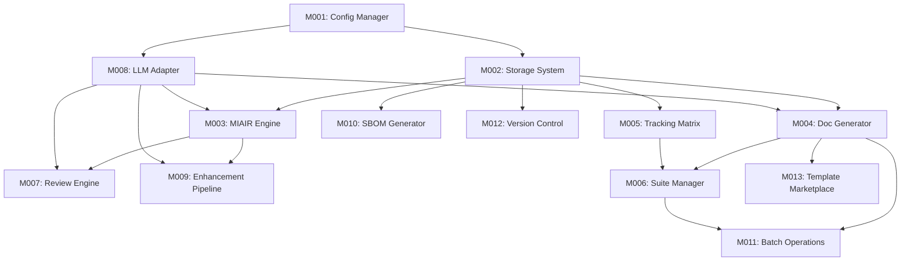

# Module Dependency Graph

**Last Updated**: 2025-08-23

## Visual Dependency Map

## Implementation Order

### Phase 1: Foundation (P0 Core)
1. M001 - Configuration Manager
2. M002 - Local Storage System

### Phase 2: Core Features (P0)
3. M004 - Document Generator
4. M005 - Tracking Matrix
5. M006 - Suite Manager
6. M007 - Review Engine

### Phase 3: AI Enhancement (P1)
7. M008 - LLM Adapter
8. M003 - MIAIR Engine
9. M009 - Enhancement Pipeline
10. M011 - Batch Operations
11. M012 - Version Control

### Phase 4: Extended Features (P2)
12. M010 - SBOM Generator
13. M013 - Template Marketplace
