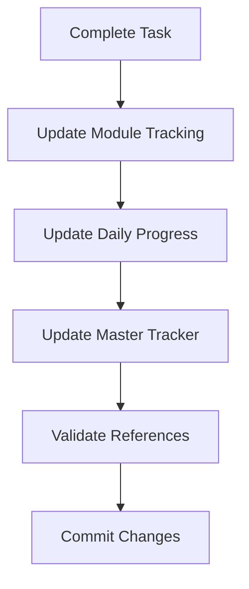

# DevDocAI v3.6.0 AI Agent Filing System

**Version:** 1.0.0  
**Date:** August 23, 2025  
**Purpose:** Comprehensive filing system for AI Agent-driven development  
**Status:** ACTIVE SYSTEM DESIGN

---

## Executive Summary

This filing system enables AI Agents to efficiently navigate, reference, and update documentation throughout the DevDocAI v3.6.0 development lifecycle. It establishes a clear hierarchy between immutable design specifications (source of truth) and mutable tracking/working documents, ensuring development stays aligned with the planned architecture while maintaining progress visibility.

---

## 1. Directory Structure

```
/workspaces/DevDocAI-v3.6.0/
├── docs/                                    # Root documentation directory
│   ├── 00-system/                          # System control documents
│   │   ├── AI-AGENT-FILING-SYSTEM.md       # This document (master reference)
│   │   ├── AI-AGENT-INSTRUCTIONS.md        # Agent operational guidelines
│   │   ├── DATA-INTEGRITY-RULES.md         # Validation and consistency rules
│   │   └── REFERENCE-INDEX.md              # Master index of all documents
│   │
│   ├── 01-design-specs/                    # IMMUTABLE source of truth
│   │   ├── DESIGN-devdocai-prd.md          # Product Requirements
│   │   ├── DESIGN-devdocai-srs.md          # Software Requirements
│   │   ├── DESIGN-devdocsai-sdd.md         # Software Design Document
│   │   ├── DESIGN-devdocsai-architecture.md # System Architecture
│   │   ├── DESIGN-devdocsai-user-stories.md # User Stories
│   │   ├── DESIGN-devdocai-api-documentation.md
│   │   ├── DESIGN-devdocai-test-plan.md
│   │   ├── DESIGN-devdocai-mockups.md
│   │   ├── DESIGN-devdocsai-scmp.md        # Configuration Management
│   │   ├── DESIGN-devdocsai-traceability-matrix.md
│   │   ├── DESIGN-devdocai-build-instructions.md
│   │   ├── DESIGN-devdocai-deployment-installation-guide.md
│   │   ├── DESIGN-devdocai-maintenance-plan.md
│   │   ├── DESIGN-devdocai-user-docs.md
│   │   └── DESIGN-devdocai-user-manual.md
│   │
│   ├── 02-tracking/                        # MUTABLE progress tracking
│   │   ├── implementation-status-tracker.md # Master implementation tracker
│   │   ├── module-progress/                # Per-module tracking
│   │   │   ├── M001-config-manager.tracking.md
│   │   │   ├── M002-storage-system.tracking.md
│   │   │   ├── M003-miair-engine.tracking.md
│   │   │   ├── M004-document-generator.tracking.md
│   │   │   ├── M005-tracking-matrix.tracking.md
│   │   │   ├── M006-suite-manager.tracking.md
│   │   │   ├── M007-review-engine.tracking.md
│   │   │   ├── M008-llm-adapter.tracking.md
│   │   │   ├── M009-enhancement-pipeline.tracking.md
│   │   │   ├── M010-sbom-generator.tracking.md
│   │   │   ├── M011-batch-operations.tracking.md
│   │   │   ├── M012-version-control.tracking.md
│   │   │   └── M013-template-marketplace.tracking.md
│   │   ├── daily-progress/                 # Daily snapshots
│   │   │   └── YYYY-MM-DD-progress.md
│   │   └── decision-log/                   # Architecture decisions
│   │       └── ADR-NNNN-title.md
│   │
│   ├── 03-working/                         # MUTABLE working documents
│   │   ├── current-sprint/                 # Active development
│   │   │   ├── sprint-plan.md
│   │   │   ├── blockers.md
│   │   │   └── dependencies.md
│   │   ├── integration-notes/              # Cross-module integration
│   │   │   └── module-interfaces.md
│   │   └── validation-reports/             # Test results
│   │       └── YYYY-MM-DD-validation.md
│   │
│   └── 04-reference/                       # Quick reference guides
│       ├── module-dependency-graph.md
│       ├── api-endpoint-registry.md
│       ├── error-code-registry.md
│       └── glossary.md
```

---

## 2. Document Categorization Schema

### Category Levels

| Level | Category | Mutability | Purpose | AI Agent Access |
|-------|----------|------------|---------|-----------------|
| **L0** | System Control | Read-Only | Filing system rules and instructions | READ ONLY |
| **L1** | Design Specifications | IMMUTABLE | Source of truth for all development | READ ONLY |
| **L2** | Progress Tracking | MUTABLE | Track implementation progress | READ/WRITE |
| **L3** | Working Documents | MUTABLE | Active development artifacts | READ/WRITE |
| **L4** | Reference Guides | Semi-Mutable | Quick lookups and registries | READ/APPEND |

### Document Types

| Type Code | Document Type | Example | Update Frequency |
|-----------|--------------|---------|------------------|
| **SPEC** | Specification | DESIGN-*.md | Never (immutable) |
| **TRACK** | Tracking | *.tracking.md | Per task completion |
| **WORK** | Working | sprint-plan.md | Daily/As needed |
| **REF** | Reference | glossary.md | On new terms |
| **LOG** | Decision Log | ADR-*.md | Per decision |
| **RPT** | Report | validation.md | Per test run |

---

## 3. Naming Conventions

### File Naming Pattern

```
[PREFIX]-[module]-[component]-[type].[version].md

Examples:
- DESIGN-devdocai-prd.md (Design specification)
- M001-config-manager.tracking.md (Module tracking)
- ADR-0001-database-choice.md (Architecture decision)
- 2025-08-23-progress.md (Daily progress)
```

### Naming Rules

1. **Prefixes**:
   - `DESIGN-` : Immutable design specifications
   - `M###-` : Module-specific documents (e.g., M001, M002)
   - `ADR-` : Architecture Decision Records
   - `TEST-` : Test results and reports
   - `REF-` : Reference documents

2. **Module Codes**:
   ```
   M001: Configuration Manager
   M002: Local Storage System
   M003: MIAIR Engine
   M004: Document Generator
   M005: Tracking Matrix
   M006: Suite Manager
   M007: Review Engine
   M008: LLM Adapter
   M009: Enhancement Pipeline
   M010: SBOM Generator
   M011: Batch Operations Manager
   M012: Version Control Integration
   M013: Template Marketplace
   ```

3. **Version Suffixes** (for mutable documents):
   - `.v1.0.md` : Major version
   - `.draft.md` : Work in progress
   - `.final.md` : Approved version

---

## 4. Metadata Structure

### Document Header Template

```markdown
---
document_id: [UNIQUE-ID]
document_type: [SPEC|TRACK|WORK|REF|LOG|RPT]
version: [SEMVER]
last_updated: [ISO-8601]
updated_by: [AI-AGENT-ID]
status: [DRAFT|ACTIVE|APPROVED|DEPRECATED]
category_level: [L0-L4]
mutability: [IMMUTABLE|MUTABLE|APPEND-ONLY]
references:
  - [RELATED-DOC-ID-1]
  - [RELATED-DOC-ID-2]
dependencies:
  - [DEPENDENCY-DOC-ID-1]
checksum: [SHA-256]
---
```

### Tracking Metadata

```markdown
---
module_id: [M###]
component: [COMPONENT-NAME]
implementation_status:
  design: [0-100]%
  code: [0-100]%
  tests: [0-100]%
  documentation: [0-100]%
blockers:
  - id: [BLOCKER-ID]
    description: [TEXT]
    severity: [LOW|MEDIUM|HIGH|CRITICAL]
last_progress_update: [ISO-8601]
next_milestone: [MILESTONE-ID]
estimated_completion: [ISO-8601]
---
```

---

## 5. Cross-Reference System

### Reference Types

| Reference Type | Symbol | Purpose | Example |
|---------------|--------|---------|---------|
| Source | `[SRC]` | Points to source specification | `[SRC:DESIGN-prd#FR-001]` |
| Implementation | `[IMPL]` | Links to code implementation | `[IMPL:M001#config-parser]` |
| Test | `[TEST]` | Links to test case | `[TEST:TC-001]` |
| Dependency | `[DEP]` | Shows dependency | `[DEP:M002]` |
| Blocks | `[BLOCKS]` | Indicates blocker | `[BLOCKS:M003]` |
| Related | `[REL]` | Related document | `[REL:ADR-0001]` |

### Reference Format

```
[TYPE:DOCUMENT-ID#SECTION-ID]

Examples:
- [SRC:DESIGN-srs#FR-001]     # Points to Functional Requirement 001 in SRS
- [IMPL:M001#parser.line-45]   # Points to line 45 in M001's parser
- [TEST:TC-001#validation]     # Points to validation section of Test Case 001
- [DEP:M002]                   # Depends on Module 002
```

---

## 6. Progress Tracking Mechanism

### Status Indicators

```markdown
## Implementation Progress

### Overall Status
📊 **Progress**: 25% Complete
- Design: ████████████████████ 100% ✅
- Code: █████░░░░░░░░░░░░░░░ 25% 🚧
- Tests: ██░░░░░░░░░░░░░░░░░░ 10% 📝
- Docs: ███░░░░░░░░░░░░░░░░░ 15% 📝

### Module Status
| Module | Design | Code | Tests | Docs | Overall |
|--------|--------|------|-------|------|---------|
| M001 | 100% ✅ | 40% 🚧 | 20% 📝 | 30% 📝 | 47.5% |
```

### Progress Update Protocol

1. **Before Task Start**:
   ```markdown
   ## Task: [TASK-NAME]
   - Status: ⏳ PENDING
   - Assigned: [AI-AGENT-ID]
   - Started: --
   - [SRC:DESIGN-srs#REQ-ID]
   ```

2. **During Task**:
   ```markdown
   ## Task: [TASK-NAME]
   - Status: 🚧 IN PROGRESS
   - Assigned: [AI-AGENT-ID]
   - Started: 2025-08-23T10:00:00Z
   - Progress: 60%
   - [SRC:DESIGN-srs#REQ-ID]
   ```

3. **After Completion**:
   ```markdown
   ## Task: [TASK-NAME]
   - Status: ✅ COMPLETE
   - Assigned: [AI-AGENT-ID]
   - Started: 2025-08-23T10:00:00Z
   - Completed: 2025-08-23T14:30:00Z
   - [SRC:DESIGN-srs#REQ-ID]
   - [IMPL:M001#component]
   - [TEST:TC-001]
   ```

---

## 7. Data Integrity Rules

### Immutability Rules

1. **NEVER modify** files in `/01-design-specs/`
2. **NEVER delete** any DESIGN- prefixed files
3. **NEVER change** document IDs once assigned
4. **ALWAYS preserve** original timestamps

### Validation Rules

1. **Cross-Reference Validation**:
   - All [SRC] references must point to existing design specs
   - All [IMPL] references must point to actual code
   - All [TEST] references must point to valid test cases

2. **Progress Validation**:
   - Code % cannot exceed Design %
   - Tests % cannot exceed Code %
   - Documentation % should track with Code %

3. **Dependency Validation**:
   - No circular dependencies allowed
   - Dependencies must be declared before use
   - Blocked items must have blocker resolution plans

### Consistency Checks

```python
# Pseudo-code for consistency validation
def validate_progress(module):
    assert module.design_percent >= module.code_percent
    assert module.code_percent >= module.test_percent
    assert all_references_valid(module.references)
    assert no_circular_dependencies(module.dependencies)
    return True
```

---

## 8. AI Agent Access Patterns

### Read Patterns

```markdown
## Pattern 1: Requirement Lookup
1. Read REFERENCE-INDEX.md for document mapping
2. Navigate to /01-design-specs/DESIGN-devdocai-srs.md
3. Find requirement by ID (e.g., FR-001)
4. Follow cross-references to related specs

## Pattern 2: Progress Check
1. Read /02-tracking/implementation-status-tracker.md
2. For details, read /02-tracking/module-progress/M###-*.tracking.md
3. Check daily progress in /02-tracking/daily-progress/

## Pattern 3: Dependency Resolution
1. Read /04-reference/module-dependency-graph.md
2. Identify upstream dependencies
3. Check their status in respective tracking files
```

### Write Patterns

```markdown
## Pattern 1: Update Progress
1. Read current status from tracking file
2. Calculate new percentages
3. Update tracking file with new status
4. Add entry to daily progress log
5. Update master implementation tracker

## Pattern 2: Log Decision
1. Create new ADR file with next number
2. Fill in decision template
3. Update affected tracking files
4. Add cross-references to related documents

## Pattern 3: Report Blocker
1. Update module tracking file with blocker
2. Add to /03-working/current-sprint/blockers.md
3. Cross-reference affected modules
4. Propose resolution timeline
```

---

## 9. Implementation Procedures

### Phase 1: Initial Setup (Immediate)

```bash
# Create directory structure
mkdir -p docs/{00-system,01-design-specs,02-tracking/{module-progress,daily-progress,decision-log},03-working/{current-sprint,integration-notes,validation-reports},04-reference}

# Move existing design documents
mv docs/DESIGN-*.md docs/01-design-specs/

# Move tracking document
mv docs/implementation-status-tracker.md docs/02-tracking/

# Create system control documents
touch docs/00-system/{AI-AGENT-INSTRUCTIONS.md,DATA-INTEGRITY-RULES.md,REFERENCE-INDEX.md}

# Create module tracking files
for i in {001..013}; do
  touch "docs/02-tracking/module-progress/M${i}-module.tracking.md"
done
```

### Phase 2: Document Migration

1. **Preserve all DESIGN- documents** in `/01-design-specs/`
2. **Create tracking templates** for each module
3. **Initialize reference documents** with current mappings
4. **Set up daily progress template**

### Phase 3: Metadata Addition

1. **Add headers** to all documents with appropriate metadata
2. **Generate checksums** for immutable documents
3. **Create reference index** with all document IDs
4. **Establish cross-reference links**

---

## 10. Validation Procedures

### Daily Validation Checklist

- [ ] All design specs remain unmodified (checksum verify)
- [ ] Progress percentages are logically consistent
- [ ] All new references point to valid targets
- [ ] No orphaned documents exist
- [ ] Decision log entries are complete
- [ ] Daily progress has been logged

### Weekly Validation

- [ ] Module dependencies remain acyclic
- [ ] All blockers have assigned owners
- [ ] Progress trends are realistic
- [ ] Documentation coverage matches code coverage
- [ ] Cross-references are bidirectional where appropriate

---

## 11. AI Agent Instructions Summary

### Core Directives

1. **ALWAYS** check design specs before implementation
2. **NEVER** modify immutable documents
3. **UPDATE** tracking files after each task
4. **VALIDATE** references before creating links
5. **LOG** all significant decisions in ADR format
6. **MAINTAIN** consistency between all related documents

### Query Priority

1. First: Check `/00-system/REFERENCE-INDEX.md`
2. Second: Read relevant `/01-design-specs/DESIGN-*.md`
3. Third: Check `/02-tracking/` for current status
4. Fourth: Update `/03-working/` with progress
5. Fifth: Append to `/04-reference/` as needed

### Update Sequence



---

## 12. Emergency Procedures

### Corruption Recovery

1. Check document checksums against last known good
2. Restore from version control if needed
3. Rebuild tracking from commit history
4. Validate all cross-references
5. Log incident in decision log

### Conflict Resolution

1. Design specs always take precedence
2. Most recent tracking update wins
3. Preserve both versions in conflict
4. Human review for critical conflicts
5. Document resolution in ADR

---

## Appendix A: Quick Reference Card

### Document Locations
- **Source of Truth**: `/01-design-specs/DESIGN-*.md`
- **Current Progress**: `/02-tracking/implementation-status-tracker.md`
- **Today's Work**: `/02-tracking/daily-progress/YYYY-MM-DD-progress.md`
- **Active Sprint**: `/03-working/current-sprint/sprint-plan.md`
- **Quick Lookup**: `/04-reference/*.md`

### Key Commands for AI Agents
```bash
# Check requirement
grep -n "FR-001" docs/01-design-specs/DESIGN-devdocai-srs.md

# Update progress
echo "Module M001: Code 45% complete" >> docs/02-tracking/module-progress/M001-config-manager.tracking.md

# Log decision
echo "# ADR-0001: Database Selection" > docs/02-tracking/decision-log/ADR-0001-database-selection.md

# Check dependencies
grep "DEP:" docs/02-tracking/module-progress/*.tracking.md
```

---

## Appendix B: Compliance Matrix

| Requirement | Implementation | Validation Method |
|-------------|---------------|-------------------|
| AI agents can reference files | Structured paths with clear naming | Path resolution tests |
| Documents track progress | Tracking files with percentage meters | Progress validation rules |
| Prevents deviation | Immutable design specs | Checksum verification |
| Documents as source of truth | L1 category immutability | Read-only enforcement |
| Cross-referencing | Reference notation system | Link validation |
| Version tracking | Metadata headers | Version comparison |

---

*End of Filing System Design Document*