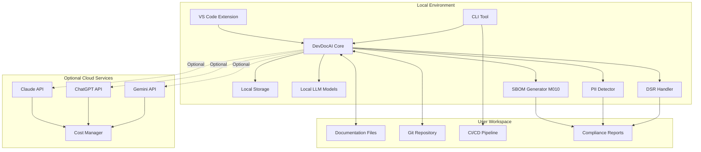

# Software Requirements Specification

## DevDocAI v3.5.0

---
⚠️ **STATUS: DESIGN SPECIFICATION - NOT IMPLEMENTED** ⚠️

**Document Type**: Design Specification  
**Implementation Status**: 0% - No code written  
**Purpose**: Blueprint for future development  

> **This document describes planned functionality and architecture that has not been built yet.**
> All code examples, commands, and installation instructions are design specifications for future implementation.

---

🏗️ **TECHNICAL SPECIFICATION STATUS**

This document contains complete technical specifications ready for implementation.
Contributors can use this as a blueprint to build the described system.

---

**Document Version:** 3.5.0  
**Date:** August 21, 2025  
**Status:** FINAL - Suite Aligned v3.5.0  
**License:** Apache-2.0 (Core), MIT (Plugin SDK)  

**Document Alignment Status:**

- ✅ User Stories v3.5.0 - All 21 stories (US-001 through US-021) mapped
- ✅ PRD v3.5.0 - Complete consistency with all requirements  
- ✅ Architecture v3.5.0 - All components (M001-M010) integrated
- ✅ Technical Alignment Complete

---

## Table of Contents

1. [Introduction](#1-introduction)
   - 1.1 [Purpose](#11-purpose)
   - 1.2 [Scope](#12-scope)
   - 1.3 [Definitions and Acronyms](#13-definitions-and-acronyms)
   - 1.4 [References](#14-references)
   - 1.5 [Overview](#15-overview)
2. [Overall Description](#2-overall-description)
   - 2.1 [Product Perspective](#21-product-perspective)
   - 2.2 [Product Functions](#22-product-functions)
   - 2.3 [User Characteristics](#23-user-characteristics)
   - 2.4 [Constraints](#24-constraints)
   - 2.5 [Assumptions and Dependencies](#25-assumptions-and-dependencies)
3. [Specific Requirements](#3-specific-requirements)
   - 3.1 [Functional Requirements](#31-functional-requirements)
   - 3.2 [Non-Functional Requirements](#32-non-functional-requirements)
   - 3.3 [Quality Metrics Definitions](#33-quality-metrics-definitions)
   - 3.4 [External Interface Requirements](#34-external-interface-requirements)
   - 3.5 [Design Constraints](#35-design-constraints)
4. [Performance Requirements](#4-performance-requirements)
   - 4.1 [Response Time Requirements](#41-response-time-requirements)
   - 4.2 [Throughput Requirements](#42-throughput-requirements)
   - 4.3 [Resource Utilization](#43-resource-utilization)
   - 4.4 [Scalability Requirements](#44-scalability-requirements)
   - 4.5 [Concurrency Requirements](#45-concurrency-requirements)
   - 4.6 [Performance Monitoring](#46-performance-monitoring)
5. [Security Requirements](#5-security-requirements)
   - 5.1 [Authentication and Authorization](#51-authentication-and-authorization)
   - 5.2 [Data Protection](#52-data-protection)
   - 5.3 [Security Analysis](#53-security-analysis)
   - 5.4 [Privacy Requirements](#54-privacy-requirements)
   - 5.5 [Audit and Compliance](#55-audit-and-compliance)
6. [Accessibility Requirements](#6-accessibility-requirements)
   - 6.1 [WCAG 2.1 Compliance](#61-wcag-21-compliance)
   - 6.2 [Keyboard Navigation](#62-keyboard-navigation)
   - 6.3 [Screen Reader Support](#63-screen-reader-support)
   - 6.4 [Visual Accessibility](#64-visual-accessibility)
   - 6.5 [Testing and Validation](#65-testing-and-validation)
7. [User Interface Requirements](#7-user-interface-requirements)
   - 7.1 [VS Code Extension Interface](#71-vs-code-extension-interface)
   - 7.2 [Command Line Interface](#72-command-line-interface)
   - 7.3 [Documentation Health Dashboard](#73-documentation-health-dashboard)
   - 7.4 [Progressive Disclosure](#74-progressive-disclosure)
8. [System Requirements](#8-system-requirements)
   - 8.1 [Hardware Requirements](#81-hardware-requirements)
   - 8.2 [Software Requirements](#82-software-requirements)
   - 8.3 [Network Requirements](#83-network-requirements)
   - 8.4 [Traceability Matrix](#84-traceability-matrix)
9. [Testing Requirements](#9-testing-requirements)
   - 9.1 [Unit Testing](#91-unit-testing)
   - 9.2 [Integration Testing](#92-integration-testing)
   - 9.3 [Performance Testing](#93-performance-testing)
   - 9.4 [Security Testing](#94-security-testing)
   - 9.5 [Accessibility Testing](#95-accessibility-testing)
   - 9.6 [Compliance Testing](#96-compliance-testing)
10. [Appendices](#10-appendices)
    - [A. API Specifications](#a-api-specifications)
    - [B. Data Models](#b-data-models)
    - [C. Error Codes](#c-error-codes)
    - [D. Conformance Test Plan](#d-conformance-test-plan)

---

## 1. Introduction

### 1.1 Purpose

This Software Requirements Specification (SRS) provides a comprehensive definition of the functional and non-functional requirements for DevDocAI v3.5.0, an AI-powered documentation generation and management system designed for solo developers and small teams. This document serves as the primary reference for development, testing, and validation activities, with complete alignment to User Stories v3.5.0, PRD v3.5.0, and Architecture Blueprint v3.5.0.

The intended audiences include:

- Development team members implementing DevDocAI features
- Quality assurance engineers validating system behavior
- Project stakeholders evaluating progress and compliance
- Technical writers documenting the system
- Compliance officers ensuring regulatory adherence
- End users understanding system capabilities

### 1.2 Scope

DevDocAI v3.5.0 is an open-source documentation enhancement and generation system that empowers individual developers to create, analyze, and maintain professional-grade technical documentation with enterprise-level compliance features. The system leverages artificial intelligence, specifically the Meta-Iterative AI Refinement (MIAIR) methodology, to deliver enterprise-quality documentation capabilities without requiring dedicated technical writing resources.

**In Scope:**

- Automated document generation from templates and AI synthesis
- Multi-dimensional document analysis and quality scoring
- Cross-document consistency management and impact analysis
- AI-powered document enhancement using multiple LLM providers
- VS Code extension with real-time documentation assistance
- Command-line interface for automation and CI/CD integration
- Documentation health dashboard with progressive disclosure
- Privacy-first architecture with local operation capabilities
- Plugin architecture with comprehensive security model
- Accessibility compliance (WCAG 2.1 Level AA)
- Cost management and API quota optimization
- Software Bill of Materials (SBOM) generation
- Personally Identifiable Information (PII) detection
- Data Subject Rights (DSR) implementation

**Out of Scope:**

- Real-time collaborative editing between multiple users
- Version control system implementation (relies on existing Git)
- Cloud hosting services (users deploy locally or self-host)
- Mobile application development
- Natural language voice interfaces
- Translation services

### 1.3 Definitions and Acronyms

| Term | Definition |
|------|------------|
| **AC** | Acceptance Criteria - Testable conditions for user story completion |
| **AES-256-GCM** | Advanced Encryption Standard with 256-bit key in Galois/Counter Mode |
| **API** | Application Programming Interface |
| **Argon2id** | Memory-hard key derivation function for password hashing |
| **CCPA** | California Consumer Privacy Act |
| **CLI** | Command Line Interface |
| **Coherence Index** | Metric measuring logical flow and structure quality (0-1 scale) |
| **CRL** | Certificate Revocation List |
| **CVSS** | Common Vulnerability Scoring System |
| **CycloneDX** | OWASP SBOM standard format v1.4 |
| **DSR** | Data Subject Rights (GDPR/CCPA compliance) |
| **Ed25519** | Elliptic curve digital signature algorithm |
| **Entropy Metrics** | Measure of document organization and information density (0-1 scale) |
| **FR** | Functional Requirement |
| **GDPR** | General Data Protection Regulation |
| **LLM** | Large Language Model (e.g., ChatGPT, Claude, Gemini) |
| **MIAIR** | Meta-Iterative AI Refinement methodology |
| **NFR** | Non-Functional Requirement |
| **OCSP** | Online Certificate Status Protocol |
| **OWASP** | Open Web Application Security Project |
| **PII** | Personally Identifiable Information |
| **PRD** | Product Requirements Document |
| **Quality Gate** | Minimum quality threshold for documentation (exactly 85%) |
| **Quality Score** | Composite metric for document quality (0-100 scale) |
| **SBOM** | Software Bill of Materials |
| **SPDX** | Software Package Data Exchange v2.3 |
| **SRS** | Software Requirements Specification |
| **Tracking Matrix** | Visual system for monitoring document relationships and versions |
| **US** | User Story |
| **WCAG** | Web Content Accessibility Guidelines |

### 1.4 References

1. IEEE Std 830-1998: IEEE Recommended Practice for Software Requirements Specifications
2. WCAG 2.1: Web Content Accessibility Guidelines Level AA
3. ISO/IEC 25010:2011: Systems and software Quality Requirements and Evaluation
4. OWASP Application Security Verification Standard v4.0.3
5. DevDocAI Product Requirements Document v3.5.0
6. DevDocAI User Stories & Acceptance Criteria v3.5.0
7. DevDocAI Architecture Blueprint v3.5.0
8. SPDX Specification v2.3
9. CycloneDX Specification v1.4
10. GDPR Articles 15-22 (Data Subject Rights)

### 1.5 Overview

This document is organized according to IEEE 830 standard with enhancements for modern software practices and compliance requirements. Section 2 provides product context and constraints. Section 3 details functional and non-functional requirements with complete traceability to user stories and architecture components. Section 4 specifies comprehensive performance requirements with measurable targets aligned to the Architecture's standardized memory modes. Sections 5-6 address security and accessibility requirements. Section 7 defines user interface specifications. Section 8 covers system requirements and complete traceability matrix. Section 9 outlines testing requirements including compliance testing. Appendices provide detailed technical specifications including new API endpoints and data models for SBOM, PII, and DSR features.

---

## 2. Overall Description

### 2.1 Product Perspective

#### 2.1.1 System Context

DevDocAI operates as a standalone application with optional cloud service integration. The system architecture follows a modular, privacy-first design where core functionality operates locally with selective cloud enhancement capabilities. The v3.5.0 release adds comprehensive compliance features including SBOM generation, PII detection, and DSR support.



#### 2.1.2 System Interfaces

- **Version Control Integration**: Native Git integration for document versioning
- **CI/CD Integration**: Jenkins, GitHub Actions, GitLab CI, Azure DevOps support
- **IDE Integration**: VS Code extension with Language Server Protocol
- **LLM Provider APIs**: RESTful interfaces to Claude, ChatGPT, and Gemini with CostManager
- **Local LLM Support**: GGML/GGUF format models via llama.cpp
- **Compliance Interfaces**: SBOM export, PII scanning, DSR request handling

### 2.2 Product Functions

#### 2.2.1 Core Capabilities Summary

1. **Document Generation** (US-001, US-003)
   - Template-based generation with 30+ document types
   - Multi-LLM synthesis for enhanced quality
   - Batch generation for complete documentation suites

2. **Document Analysis** (US-004, US-005, US-006)
   - Multi-dimensional quality assessment
   - Specialized validation for each document type
   - Real-time feedback during editing

3. **Suite Management** (US-002, US-007, US-008)
   - Visual tracking matrix for relationships
   - Cross-document consistency verification
   - Impact analysis for change propagation

4. **AI Enhancement** (US-009)
   - MIAIR methodology for quality improvement
   - Entropy reduction and coherence optimization
   - Configurable multi-LLM synthesis with cost management

5. **Security & Privacy** (US-010, US-017)
   - Local-first operation with optional cloud
   - Comprehensive security analysis
   - Data encryption and secure deletion
   - Enhanced plugin security with signing

6. **Workflow Integration** (US-012, US-013)
   - Seamless VS Code integration
   - Powerful CLI for automation
   - CI/CD pipeline quality gates

7. **Metrics & Reporting** (US-014, US-015)
   - Documentation health dashboard
   - Learning and adaptation system
   - Export capabilities for stakeholders

8. **Extensibility** (US-016)
   - Secure plugin architecture with Ed25519 signing
   - Custom document types and analyzers
   - Community marketplace with security verification

9. **Compliance Features** (US-019, US-020, US-021)
   - SBOM generation with digital signatures
   - PII detection with 95% accuracy
   - DSR implementation for GDPR/CCPA

### 2.3 User Characteristics

| User Type | Technical Expertise | Documentation Experience | Primary Use Cases |
|-----------|-------------------|-------------------------|-------------------|
| **Solo Developers** | High programming skills | Limited documentation experience | Complete project documentation |
| **Independent Contractors** | High technical skills | Moderate documentation needs | Client deliverables |
| **Open Source Maintainers** | Advanced programming | High documentation awareness | Project documentation with SBOM |
| **Technical Writers** | Moderate technical skills | Expert documentation skills | AI-assisted writing with PII detection |
| **Startup Founders** | Varied technical skills | Limited time for documentation | Quick MVP documentation |
| **Enterprise Developers** | High technical skills | Formal documentation requirements | Compliance documentation |
| **Compliance Officers** | Moderate technical skills | High regulatory knowledge | SBOM, PII, DSR management |

### 2.4 Constraints

#### 2.4.1 Regulatory Constraints

- GDPR compliance for EU users (Articles 15-22 for DSR)
- CCPA compliance for California users
- PIPEDA compliance for Canadian users
- SOC 2 Type II compliance for enterprise deployments
- EU Cyber Resilience Act (SBOM requirements)
- US Executive Order 14028 (Software supply chain)

### 2.5 Assumptions and Dependencies

#### 2.5.1 Assumptions

- Users have basic command-line familiarity
- Internet connectivity available for cloud features
- Git installed for version control features
- VS Code installed for extension features
- Sufficient disk space for local models (2-5GB)
- Compliance officers understand regulatory requirements

#### 2.5.2 Dependencies

- LLM provider API availability and stability
- Node.js and Python ecosystem stability
- VS Code extension API compatibility
- Community contributions for plugins
- Security vulnerability databases for scanning
- Regulatory compliance databases for PII patterns

---

## 3. Specific Requirements

### 3.1 Functional Requirements

#### 3.1.1 Document Generation Requirements

**FR-001**: Template-Based Generation [Priority: High] [US-001]

- The system SHALL provide templates for 30+ document types
- The system SHALL display available templates based on document type
- The system SHALL allow custom template creation and modification
- The system SHALL validate template syntax before use
- **Test Case**: TC-001 - Verify all 30+ templates generate valid documents

**FR-002**: Multi-LLM Synthesis [Priority: High] [US-001, AC-001.2]

- The system SHALL integrate with Claude, ChatGPT, and Gemini APIs
- The system SHALL support configurable weights for each LLM (default: Claude 40%, ChatGPT 35%, Gemini 25%)
- The system SHALL implement fallback to local templates on API failure
- The system SHALL sanitize data before sending to external APIs
- **Test Case**: TC-002 - Verify LLM fallback mechanism

**FR-003**: Suite Generation [Priority: High] [US-003]

- The system SHALL generate complete documentation suites with single command
- The system SHALL establish cross-references between generated documents
- The system SHALL detect and preserve existing documents during suite generation
- The system SHALL provide rollback capability for cancelled operations
- **Test Case**: TC-003 - Verify suite generation completeness

**FR-004**: Metadata Management [Priority: Medium] [US-001, AC-001.3]

- The system SHALL automatically assign version 1.0 to new documents
- The system SHALL track creation and modification timestamps
- The system SHALL maintain author information
- The system SHALL store document relationships in tracking matrix
- **Test Case**: TC-004 - Verify metadata persistence

#### 3.1.2 Document Analysis Requirements

**FR-005**: Quality Assessment [Priority: High] [US-004]

- The system SHALL calculate quality scores using defined metrics (0-100 scale)
- The system SHALL perform document-type-specific analysis
- The system SHALL prioritize issues as Critical, High, Medium, or Low
- The system SHALL provide specific improvement recommendations
- The system SHALL enforce Quality Gate at exactly 85% threshold
- **Test Case**: TC-005 - Verify quality score calculation accuracy

**FR-006**: Requirements Validation [Priority: High] [US-005]

- The system SHALL detect ambiguous language in requirements
- The system SHALL verify requirement testability
- The system SHALL check requirement completeness
- The system SHALL identify requirement conflicts
- **Test Case**: TC-006 - Verify ambiguity detection

**FR-007**: Specialized Reviews [Priority: Medium] [US-006]

- The system SHALL verify dependency specifications in build instructions
- The system SHALL check API documentation completeness
- The system SHALL assess readability for user manuals (target: 8th grade level)
- The system SHALL calculate test coverage metrics (80% minimum, 90% critical paths)
- **Test Case**: TC-007 - Verify specialized review accuracy

#### 3.1.3 Suite Management Requirements

**FR-008**: Tracking Matrix [Priority: High] [US-002, M005]

- The system SHALL display visual representation of document relationships
- The system SHALL show document versions and modification dates
- The system SHALL indicate dependency directions with arrows
- The system SHALL use color coding for consistency status
- The system SHALL update within 1 second of changes
- **Test Case**: TC-008 - Verify matrix update performance

**FR-009**: Consistency Analysis [Priority: High] [US-007, M006]

- The system SHALL verify traceability from requirements to tests
- The system SHALL identify missing critical documents
- The system SHALL validate cross-reference integrity
- The system SHALL detect terminology inconsistencies
- **Test Case**: TC-009 - Verify consistency detection

**FR-010**: Impact Analysis [Priority: Medium] [US-008, M006]

- The system SHALL identify affected documents when changes occur
- The system SHALL highlight specific sections needing updates
- The system SHALL provide effort estimates for required changes
- The system SHALL detect circular dependencies
- **Test Case**: TC-010 - Verify impact analysis accuracy

#### 3.1.4 Enhancement Requirements

**FR-011**: MIAIR Enhancement [Priority: High] [US-009, M003]

- The system SHALL apply MIAIR methodology for document improvement
- The system SHALL display entropy reduction metrics (60-75% target)
- The system SHALL show side-by-side diff view of changes
- The system SHALL mark AI-generated content clearly
- **Test Case**: TC-011 - Verify entropy reduction

**FR-012**: Multi-LLM Enhancement [Priority: High] [US-009, AC-009.2, M008]

- The system SHALL combine outputs from multiple LLMs
- The system SHALL support configurable synthesis strategies
- The system SHALL implement weighted consensus arbitration
- The system SHALL handle partial LLM failures gracefully
- **Test Case**: TC-012 - Verify LLM synthesis

#### 3.1.5 Security Analysis Requirements

**FR-013**: Security Scanning [Priority: High] [US-010]

- The system SHALL identify security-relevant content automatically
- The system SHALL detect exposed credentials in documentation
- The system SHALL recommend security design patterns
- The system SHALL rank findings by CVSS severity
- **Test Case**: TC-013 - Verify security detection

**FR-014**: Compliance Checking [Priority: Medium] [US-010, AC-010.7]

- The system SHALL verify OWASP compliance
- The system SHALL reference specific guidelines for violations
- The system SHALL provide remediation suggestions
- The system SHALL generate compliance reports
- **Test Case**: TC-014 - Verify compliance checking

#### 3.1.6 Integration Requirements

**FR-015**: VS Code Integration [Priority: High] [US-012]

- The system SHALL display document health in project explorer
- The system SHALL provide real-time editing suggestions within 500ms
- The system SHALL show dependency indicators on document changes
- The system SHALL adapt to VS Code theme preferences
- **Test Case**: TC-015 - Verify VS Code response time

**FR-016**: CLI Operations [Priority: High] [US-013]

- The system SHALL support batch document processing
- The system SHALL integrate with Git hooks
- The system SHALL provide JSON output format
- The system SHALL follow Unix exit code conventions
- **Test Case**: TC-016 - Verify CLI exit codes

#### 3.1.7 Reporting Requirements

**FR-017**: Dashboard Display [Priority: High] [US-014]

- The system SHALL show overall health score prominently
- The system SHALL implement progressive disclosure for details
- The system SHALL display 30-day trend charts
- The system SHALL highlight critical issues
- **Test Case**: TC-017 - Verify dashboard rendering

**FR-018**: Export Capabilities [Priority: Medium] [US-014, AC-014.5]

- The system SHALL export reports in PDF format
- The system SHALL export reports in HTML format
- The system SHALL export data in JSON format
- The system SHALL generate executive summaries
- **Test Case**: TC-018 - Verify export formats

#### 3.1.8 Learning System Requirements

**FR-019**: Pattern Learning [Priority: Medium] [US-015]

- The system SHALL detect patterns after 5+ consistent corrections
- The system SHALL maintain terminology consistency
- The system SHALL support project-specific profiles
- The system SHALL allow preference export/import
- **Test Case**: TC-019 - Verify pattern detection threshold

**FR-020**: Adaptation Control [Priority: Low] [US-015, AC-015.5]

- The system SHALL provide one-click preference reset
- The system SHALL maintain local-only learning data
- The system SHALL support multiple preference profiles
- The system SHALL display learned patterns to users
- **Test Case**: TC-020 - Verify preference isolation

#### 3.1.9 Plugin Requirements

**FR-021**: Plugin Management [Priority: Medium] [US-016, Enhanced Security]

- The system SHALL validate plugin manifests
- The system SHALL enforce plugin sandboxing
- The system SHALL auto-generate configuration UI
- The system SHALL isolate plugin errors
- The system SHALL verify Ed25519 digital signatures (AC-016.8)
- The system SHALL validate certificate chain to DevDocAI Plugin CA root (AC-016.9)
- The system SHALL check CRL and OCSP for revocation status (AC-016.10)
- The system SHALL scan for malware before installation (AC-016.11)
- The system SHALL immediately disable revoked plugins (AC-016.12)
- **Test Case**: TC-021 - Verify plugin security chain

**FR-022**: Plugin Marketplace [Priority: Low] [US-016, AC-016.6]

- The system SHALL support plugin discovery
- The system SHALL verify plugin signatures using Ed25519
- The system SHALL display permission warnings
- The system SHALL track plugin ratings
- The system SHALL maintain plugin revocation list
- The system SHALL enforce security policies
- **Test Case**: TC-022 - Verify marketplace security

#### 3.1.10 Privacy Requirements

**FR-023**: Data Control [Priority: High] [US-017]

- The system SHALL operate fully offline when configured
- The system SHALL require explicit consent for cloud features
- The system SHALL encrypt stored API keys using AES-256-GCM
- The system SHALL provide complete data purge capability
- **Test Case**: TC-023 - Verify offline operation

**FR-024**: Offline Operation [Priority: High] [US-017, AC-017.1]

- The system SHALL maintain functionality with local models
- The system SHALL provide offline installation packages
- The system SHALL explain local model installation
- The system SHALL support air-gapped environments
- **Test Case**: TC-024 - Verify air-gapped support

#### 3.1.11 Cost Management Requirements

**FR-025**: API Cost Tracking [Priority: High] [REQ-044, M008, Enhanced]

- The system SHALL track cumulative API costs per session
- The system SHALL enforce daily spending limits (default: $10.00)
- The system SHALL enforce monthly spending limits (default: $200.00)
- The system SHALL route requests to most economical provider using cost/quality ratio
- The system SHALL warn when approaching quota limits at 80% threshold
- The system SHALL display cumulative costs per provider (AC-009.11)
- The system SHALL calculate optimal provider based on task type
- The system SHALL maintain usage history for 30 days
- **Test Case**: TC-025 - Verify cost limit enforcement

**FR-026**: Cost Optimization [Priority: Medium] [REQ-044, CostManager]

- The system SHALL cache API responses to reduce redundant calls
- The system SHALL batch requests when possible (max batch size: 10)
- The system SHALL provide cost estimates before operations
- The system SHALL fall back to local models when budget exceeded (AC-009.9)
- The system SHALL implement smart provider routing based on:
  - Cost per 1000 tokens
  - Quality score (0-1 scale)
  - Rate limits
  - Current quota usage
- The system SHALL support configurable provider weights
- **Test Case**: TC-026 - Verify fallback mechanism

#### 3.1.12 Compliance Requirements

**FR-027**: SBOM Generation [Priority: High] [US-019, M010, Enhanced]

- The system SHALL generate SBOM in SPDX 2.3 format (AC-019.1)
- The system SHALL generate SBOM in CycloneDX 1.4 format (AC-019.2)
- The system SHALL include complete dependency tree with versions (AC-019.3)
- The system SHALL identify all third-party licenses (AC-019.4)
- The system SHALL scan for known CVEs with CVSS severity scores (AC-019.5)
- The system SHALL apply Ed25519 digital signatures to SBOM (AC-019.6)
- The system SHALL export in both human and machine-readable formats (AC-019.7)
- The system SHALL complete SBOM generation within 30 seconds
- The system SHALL support incremental SBOM updates
- The system SHALL validate SBOM against schema
- **Test Case**: TC-027 - Verify SBOM completeness and signature

**FR-028**: PII Detection [Priority: High] [US-020, Enhanced]

- The system SHALL automatically detect PII with ≥95% accuracy (AC-020.1)
- The system SHALL highlight PII with severity levels (AC-020.2)
- The system SHALL support configurable sensitivity (low/medium/high) (AC-020.3)
- The system SHALL provide specific sanitization recommendations (AC-020.4)
- The system SHALL detect EU-specific PII types for GDPR (AC-020.5)
- The system SHALL detect California-specific PII for CCPA (AC-020.6)
- The system SHALL generate detailed compliance reports (AC-020.7)
- The system SHALL support pattern-based detection for:
  - Names (first, last, full)
  - Addresses (physical, email)
  - Phone numbers (international formats)
  - Social Security Numbers
  - Credit card numbers
  - National ID numbers (EU)
  - Driver's license numbers
  - Medical record numbers
  - IP addresses
  - Device identifiers
- The system SHALL use context analysis to reduce false positives
- The system SHALL maintain detection patterns database
- **Test Case**: TC-028 - Verify PII detection accuracy ≥95%

**FR-029**: Data Subject Rights [Priority: High] [US-021, New]

- The system SHALL export user data in portable format (JSON/CSV) (AC-021.1)
- The system SHALL perform cryptographic erasure with certificate (AC-021.2)
- The system SHALL support data rectification with audit trail (AC-021.3)
- The system SHALL verify identity before processing DSR (AC-021.4)
- The system SHALL respond to DSR within 30 days for GDPR (AC-021.5)
- The system SHALL encrypt exported data with user-provided key (AC-021.6)
- The system SHALL generate deletion certificate with timestamp (AC-021.7)
- The system SHALL maintain tamper-evident audit logs (AC-021.8)
- The system SHALL support automated DSR workflows:
  - Access request (data export)
  - Deletion request (right to be forgotten)
  - Rectification request (data correction)
  - Portability request (machine-readable export)
  - Restriction request (processing limitation)
  - Objection request (opt-out)
- The system SHALL generate DSR compliance reports
- The system SHALL maintain DSR request history
- **Test Case**: TC-029 - Verify DSR workflow completion

### 3.2 Non-Functional Requirements

#### 3.2.1 Performance Requirements

**NFR-001**: Response Time [Priority: High]

- VS Code extension feedback SHALL appear within 500ms
- Document analysis SHALL complete within 10 seconds for single documents
- Suite analysis SHALL complete within 2 minutes for 20 documents
- Matrix updates SHALL render within 1 second (target: 500ms)
- **Test Case**: TC-NFR-001 - Measure response times

**NFR-002**: Throughput [Priority: Medium]

- The system SHALL process 100 documents per hour minimum
- The system SHALL support 50 concurrent analysis operations
- The system SHALL handle 1000 documents in tracking matrix
- The system SHALL manage 5000 cross-references
- **Test Case**: TC-NFR-002 - Verify throughput limits

**NFR-003**: Resource Usage [Priority: Medium]

- Memory usage SHALL NOT exceed limits per mode:
  - Baseline Mode: <2GB RAM
  - Standard Mode: 2-4GB RAM
  - Enhanced Mode: 4-8GB RAM
  - Performance Mode: 8GB+ RAM
- CPU usage SHALL not exceed 80% during analysis
- Disk I/O SHALL be optimized with caching
- Network bandwidth SHALL be minimized through compression
- **Test Case**: TC-NFR-003 - Monitor resource usage

#### 3.2.2 Reliability Requirements

**NFR-004**: Availability [Priority: High]

- Core features SHALL maintain 99.9% availability
- The system SHALL recover from crashes within 30 seconds
- The system SHALL preserve work during unexpected termination
- The system SHALL provide graceful degradation
- **Test Case**: TC-NFR-004 - Test crash recovery

**NFR-005**: Fault Tolerance [Priority: High]

- The system SHALL handle API failures with local fallback
- The system SHALL recover from corrupted data
- The system SHALL validate input to prevent crashes
- The system SHALL isolate plugin failures
- **Test Case**: TC-NFR-005 - Test fault scenarios

#### 3.2.3 Usability Requirements

**NFR-006**: Learnability [Priority: High]

- New users SHALL generate first document within 5 minutes
- Command syntax SHALL follow industry conventions
- Error messages SHALL provide actionable solutions
- Documentation SHALL include examples for all features
- **Test Case**: TC-NFR-006 - User onboarding test

**NFR-007**: Efficiency [Priority: Medium]

- Common operations SHALL require ≤3 user actions
- Keyboard shortcuts SHALL be available for frequent tasks
- Batch operations SHALL reduce repetitive actions
- Progressive disclosure SHALL prevent information overload
- **Test Case**: TC-NFR-007 - Measure user actions

#### 3.2.4 Security Requirements

**NFR-008**: Data Protection [Priority: High]

- API keys SHALL be encrypted with AES-256-GCM
- Sensitive data SHALL be sanitized before transmission
- Local storage SHALL use OS-level protection
- Secure deletion SHALL prevent data recovery
- **Test Case**: TC-NFR-008 - Verify encryption

**NFR-009**: Access Control [Priority: Medium]

- Plugin permissions SHALL be explicitly granted
- File access SHALL respect OS permissions
- API access SHALL require authentication
- Audit logs SHALL track security events
- **Test Case**: TC-NFR-009 - Test access control

#### 3.2.5 Maintainability Requirements

**NFR-010**: Modularity [Priority: High]

- Components SHALL have clearly defined interfaces
- Dependencies SHALL be minimized between modules
- Code coverage SHALL meet targets:
  - Overall: ≥80%
  - Critical paths: ≥90%
  - Security functions: 100%
- Technical debt SHALL be tracked and managed
- **Test Case**: TC-NFR-010 - Measure code coverage

**NFR-011**: Extensibility [Priority: Medium]

- Plugin API SHALL remain backward compatible
- New document types SHALL be addable without core changes
- Custom analyzers SHALL integrate through standard interfaces
- Configuration SHALL support extension without modification
- **Test Case**: TC-NFR-011 - Test plugin compatibility

#### 3.2.6 Portability Requirements

**NFR-012**: Platform Independence [Priority: High]

- Core logic SHALL be platform-agnostic
- File paths SHALL use appropriate separators
- Dependencies SHALL be available cross-platform
- Installation SHALL work on all supported systems
- **Test Case**: TC-NFR-012 - Cross-platform testing

**NFR-013**: Data Portability [Priority: Medium]

- Documents SHALL use standard formats (Markdown, JSON)
- Preferences SHALL be exportable/importable
- Project data SHALL be transferable between systems
- Version control SHALL maintain compatibility
- **Test Case**: TC-NFR-013 - Test data migration

#### 3.2.7 Compliance Requirements (New)

**NFR-014**: SBOM Generation Performance [Priority: Medium]

- SBOM generation SHALL complete within 60 seconds for projects with <1000 dependencies
- SBOM generation SHALL complete within 30 seconds for typical projects (<500 dependencies)
- SBOM validation SHALL complete within 5 seconds
- **Test Case**: TC-NFR-014 - Measure SBOM generation time

**NFR-015**: PII Detection Accuracy [Priority: High]

- PII detection false positive rate SHALL be <5%
- PII detection false negative rate SHALL be <5%
- PII detection SHALL process documents at ≥1000 words per second
- **Test Case**: TC-NFR-015 - Validate PII accuracy metrics

**NFR-016**: DSR Processing Time [Priority: High]

- Automated DSR requests SHALL be processed within 24 hours
- DSR export SHALL complete within 1 hour for typical data volumes
- DSR deletion SHALL complete within 30 minutes
- DSR audit logs SHALL be generated in real-time
- **Test Case**: TC-NFR-016 - Measure DSR processing times

### 3.3 Quality Metrics Definitions

#### 3.3.1 Quality Score Calculation

**Definition**: Composite metric measuring overall document quality on a 0-100 scale.

**Formula**:

```
Q(d) = α × E(d) + β × C(d) + γ × R(d)

Where:
- Q(d) = Quality Score for document d
- E(d) = Entropy Score (0-1, normalized to 0-100)
- C(d) = Coherence Index (0-1, normalized to 0-100)  
- R(d) = Completeness Rating (0-100)
- α = 0.35 (entropy weight)
- β = 0.35 (coherence weight)
- γ = 0.30 (completeness weight)
```

**Measurement Procedure**:

1. Calculate entropy using Shannon entropy on document sections
2. Measure coherence using semantic similarity between paragraphs
3. Assess completeness against document type requirements
4. Apply weighted formula and round to nearest integer
5. Cache results for 1 hour to avoid recalculation

**Acceptance Threshold**: Quality Score = exactly 85% for quality gate pass

#### 3.3.2 Entropy Score Calculation

**Definition**: Measure of information organization and density (0-1 scale, lower is better).

**Formula**:

```
E(d) = -Σ[p(xi) × log2(p(xi))] × f(Tx)

Where:
- p(xi) = Probability of term xi in document
- f(Tx) = Transformation function based on document type
- Result normalized to 0-1 range
```

**Target Range**:

- 0.05 - 0.15 (excellent)
- 0.15 - 0.25 (good)
- >0.25 (needs improvement)

**Improvement Target**: 60-75% reduction through MIAIR

#### 3.3.3 Coherence Index Calculation

**Definition**: Measure of logical flow and structure quality (0-1 scale, higher is better).

**Formula**:

```
C(d) = (1/n) × Σ[sim(si, si+1)]

Where:
- n = Number of section pairs
- sim = Cosine similarity between adjacent sections
- si = Vector representation of section i
```

**Acceptance Threshold**: Coherence Index ≥ 0.94

#### 3.3.4 Completeness Rating

**Definition**: Percentage of required sections present for document type.

**Calculation**:

```
R(d) = (Sections_Present / Sections_Required) × 100
```

**Acceptance Threshold**: Completeness ≥ 95%

#### 3.3.5 Code Coverage Metrics

**Definition**: Percentage of code tested by automated tests.

**Targets**:

- Overall Coverage: ≥80%
- Critical Path Coverage: ≥90%
- Security Function Coverage: 100%
- SBOM Generation Coverage: ≥85%
- PII Detection Coverage: ≥90%
- DSR Workflow Coverage: ≥85%

#### 3.3.6 SBOM Completeness Metrics

**Definition**: Measure of SBOM information completeness.

**Components**:

- Dependency Coverage: 100% of direct and transitive dependencies
- License Identification: ≥95% of components with identified licenses
- Version Specification: 100% of components with exact versions
- Vulnerability Mapping: 100% of known CVEs included

#### 3.3.7 PII Detection Accuracy Metrics

**Definition**: Measure of PII detection effectiveness.

**Metrics**:

- True Positive Rate (Sensitivity): ≥95%
- True Negative Rate (Specificity): ≥95%
- Precision: ≥95%
- F1 Score: ≥0.95
- Processing Speed: ≥1000 words/second

### 3.4 External Interface Requirements

#### 3.4.1 User Interfaces

**UI-001**: VS Code Extension Interface

- Tree view for document explorer with health indicators
- Inline overlays for real-time suggestions
- Side panel for analysis results
- Status bar for quick metrics
- Context menus for document operations
- Compliance dashboard for SBOM/PII/DSR

**UI-002**: Command Line Interface

- POSIX-compliant command structure
- Colored output with --no-color option
- Progress indicators for long operations
- Machine-readable JSON output
- Interactive prompts for confirmations
- Compliance commands: `sbom`, `pii-scan`, `dsr`

**UI-003**: Documentation Dashboard

- Responsive design (mobile, tablet, desktop)
- Dark/light theme support
- Exportable charts and graphs
- Keyboard-navigable interface
- Print-friendly layouts
- Compliance section with SBOM viewer

#### 3.4.2 Software Interfaces

**SI-001**: LLM Provider APIs

- Claude API v1 (Anthropic)
- OpenAI API v1 (ChatGPT)
- Google AI API v1 (Gemini)
- Rate limiting and retry logic
- Error handling and fallback
- Cost tracking integration

**SI-002**: Version Control APIs

- Git command-line interface
- GitHub REST API v3
- GitLab API v4
- Bitbucket API v2

**SI-003**: Compliance APIs

- SPDX validation service
- CVE database API
- License database API
- PII pattern database

### 3.5 Design Constraints

#### 3.5.1 Standards Compliance

- IEEE 830-1998 for requirements specification
- ISO/IEC 25010 for quality characteristics
- RFC 2119 for requirement levels
- Semantic Versioning 2.0.0
- SPDX 2.3 for SBOM format
- CycloneDX 1.4 for alternative SBOM
- GDPR Articles 15-22 for DSR
- CCPA Title 1.81.5 for California privacy

---

## 4. Performance Requirements

### 4.1 Response Time Requirements

#### 4.1.1 Interactive Operations

| Operation | Target Time | Maximum Time | Measurement Point | Related US |
|-----------|------------|--------------|-------------------|------------|
| VS Code suggestion display | ≤500ms | 1s | From keystroke to overlay | AC-012.2 |
| Matrix dependency update | ≤500ms | 1s | From save to indicator | AC-002.5, AC-012.4 |
| Dashboard initial load | ≤2s | 3s | From request to render | AC-014.7 |
| Real-time analysis feedback | ≤500ms | 1s | From change to highlight | AC-012.3 |
| Context menu display | ≤100ms | 200ms | From right-click to menu | AC-012.5 |
| PII highlight display | ≤300ms | 500ms | From detection to visual | US-020 |
| Cost estimate display | ≤200ms | 400ms | From request to show | AC-009.11 |

#### 4.1.2 Processing Operations

| Operation | Target Time | Maximum Time | Conditions | Related US |
|-----------|------------|--------------|------------|------------|
| Single document generation | ≤30s | 60s | With LLM synthesis | US-001 |
| Single document analysis | ≤10s | 30s | Standard complexity | US-004, US-005 |
| Enhancement (MIAIR) | ≤45s | 90s | ≤10 iterations | US-009 |
| Requirements validation | ≤10s | 30s | 100 requirements | US-005 |
| Security scan | ≤15s | 45s | Full document | US-010 |
| SBOM generation | ≤30s | 60s | <500 dependencies | US-019 |
| PII detection | ≤5s | 10s | 10-page document | US-020 |
| DSR export | ≤60s | 300s | Typical user data | US-021 |

### 4.2 Throughput Requirements

#### 4.2.1 Document Processing

- Minimum: 100 documents/hour single-threaded
- Target: 500 documents/hour with parallelization
- Peak: 1000 documents/hour with full resources

#### 4.2.2 Compliance Processing

| Operation | Throughput | Conditions |
|-----------|------------|------------|
| SBOM generation | 20/hour | Full dependency scan |
| PII scanning | 1000 pages/hour | Text documents |
| DSR processing | 10 requests/hour | Automated workflow |

### 4.3 Resource Utilization

#### 4.3.1 Memory Constraints (Standardized v3.5.0)

**Table 21: Standardized Memory Modes**

| Mode | RAM Usage | Features Available | Performance |
|------|-----------|-------------------|-------------|
| **Baseline Mode** | <2GB | Templates only, no AI | Basic operations |
| **Standard Mode** | 2-4GB | Full features, cloud LLMs | Normal speed |
| **Enhanced Mode** | 4-8GB | Local LLMs, heavy caching | 2x faster |
| **Performance Mode** | >8GB | All features, max optimization | Maximum speed |

#### 4.3.2 CPU Utilization

- Idle: <5% CPU usage
- Active analysis: <80% CPU usage
- Batch processing: Configurable 50-100%
- Background tasks: <20% CPU usage
- SBOM generation: <60% CPU usage
- PII scanning: <40% CPU usage

---

## 5. Security Requirements

[Previous sections 5.1-5.4 remain the same]

### 5.5 Audit and Compliance

#### 5.5.1 Logging Requirements

**SEC-011**: Security Logging

- Security events SHALL be logged with timestamps
- Logs SHALL be tamper-evident using HMAC
- Log rotation SHALL prevent disk exhaustion
- Sensitive data SHALL not appear in logs
- DSR requests SHALL be logged with audit trail
- Plugin verification SHALL be logged

#### 5.5.2 Compliance Validation

**SEC-012**: Standards Compliance

- GDPR requirements SHALL be met for EU users
- CCPA requirements SHALL be met for California users
- OWASP guidelines SHALL be followed
- Security updates SHALL be provided promptly
- SBOM SHALL be generated for supply chain transparency
- PII detection SHALL meet regulatory standards

---

## 8. System Requirements

[Previous sections 8.1-8.3 remain the same]

### 8.4 Traceability Matrix

#### 8.4.1 Complete Requirements to User Stories Mapping (v3.5.0)

| Requirement | User Story | Architecture Component | Acceptance Criteria | Test Case | Priority | Status |
|-------------|------------|----------------------|-------------------|-----------|----------|---------|
| FR-001 | US-001 | M004 | AC-001.1 to AC-001.7 | TC-001 | High | Planned |
| FR-002 | US-001 | M008 | AC-001.2, AC-001.6 | TC-002 | High | Planned |
| FR-003 | US-003 | M006 | AC-003.1 to AC-003.6 | TC-003 | High | Planned |
| FR-004 | US-001 | M002 | AC-001.3, AC-001.4 | TC-004 | Medium | Planned |
| FR-005 | US-004 | M007 | AC-004.1 to AC-004.7 | TC-005 | High | Planned |
| FR-006 | US-005 | M007 | AC-005.1 to AC-005.7 | TC-006 | High | Planned |
| FR-007 | US-006 | M007 | AC-006.1 to AC-006.7 | TC-007 | Medium | Planned |
| FR-008 | US-002 | M005 | AC-002.1 to AC-002.8 | TC-008 | High | Planned |
| FR-009 | US-007 | M006 | AC-007.1 to AC-007.7 | TC-009 | High | Planned |
| FR-010 | US-008 | M006 | AC-008.1 to AC-008.7 | TC-010 | Medium | Planned |
| FR-011 | US-009 | M003 | AC-009.1, AC-009.5 | TC-011 | High | Planned |
| FR-012 | US-009 | M008 | AC-009.2 to AC-009.4 | TC-012 | High | Planned |
| FR-013 | US-010 | Security | AC-010.1 to AC-010.4 | TC-013 | High | Planned |
| FR-014 | US-010 | Security | AC-010.7 | TC-014 | Medium | Planned |
| FR-015 | US-012 | VS Code Ext | AC-012.1 to AC-012.8 | TC-015 | High | Planned |
| FR-016 | US-013 | CLI | AC-013.1 to AC-013.8 | TC-016 | High | Planned |
| FR-017 | US-014 | Dashboard | AC-014.1 to AC-014.4 | TC-017 | High | Planned |
| FR-018 | US-014 | Dashboard | AC-014.5 | TC-018 | Medium | Planned |
| FR-019 | US-015 | Learning | AC-015.1 to AC-015.4 | TC-019 | Medium | Planned |
| FR-020 | US-015 | Learning | AC-015.5 to AC-015.7 | TC-020 | Low | Planned |
| FR-021 | US-016 | Plugin Mgr | AC-016.1 to AC-016.12 | TC-021 | Medium | Planned |
| FR-022 | US-016 | Marketplace | AC-016.6, AC-016.7 | TC-022 | Low | Planned |
| FR-023 | US-017 | M002 | AC-017.1 to AC-017.6 | TC-023 | High | Planned |
| FR-024 | US-017 | M002 | AC-017.7 to AC-017.9 | TC-024 | High | Planned |
| FR-025 | REQ-044 | M008 | AC-009.9 to AC-009.12 | TC-025 | High | Planned |
| FR-026 | REQ-044 | CostManager | COST-002-OPT | TC-026 | Medium | Planned |
| FR-027 | US-019 | M010 | AC-019.1 to AC-019.7 | TC-027 | High | Planned |
| FR-028 | US-020 | M007 | AC-020.1 to AC-020.7 | TC-028 | High | Planned |
| FR-029 | US-021 | DSR Handler | AC-021.1 to AC-021.8 | TC-029 | High | Planned |

#### 8.4.2 Architecture Component Coverage

| Component ID | Component Name | Functional Requirements | User Stories |
|--------------|---------------|------------------------|--------------|
| M001 | Configuration Manager | FR-023, FR-024 | US-017 |
| M002 | Local Storage System | FR-004, FR-023, FR-024 | US-001, US-017 |
| M003 | MIAIR Engine | FR-011 | US-009 |
| M004 | Document Generator | FR-001 | US-001 |
| M005 | Tracking Matrix | FR-008 | US-002 |
| M006 | Suite Manager | FR-003, FR-009, FR-010 | US-003, US-007, US-008 |
| M007 | Review Engine | FR-005, FR-006, FR-007, FR-028 | US-004, US-005, US-006, US-020 |
| M008 | LLM Adapter | FR-002, FR-012, FR-025, FR-026 | US-001, US-009, REQ-044 |
| M009 | Enhancement Pipeline | FR-011, FR-012 | US-009 |
| M010 | SBOM Generator | FR-027 | US-019 |

---

## 9. Testing Requirements

[Previous sections 9.1-9.5 remain the same]

### 9.6 Compliance Testing

#### 9.6.1 SBOM Testing

**TEST-006**: SBOM Validation

- SBOM format validation against SPDX 2.3 schema
- SBOM format validation against CycloneDX 1.4 schema
- Dependency completeness verification (100%)
- License detection accuracy (≥95%)
- CVE mapping accuracy (100% of known)
- Digital signature verification (Ed25519)
- Generation time measurement (<30s typical)

#### 9.6.2 PII Testing

**TEST-007**: PII Detection Validation

- Accuracy testing with known PII datasets
- False positive rate measurement (<5%)
- False negative rate measurement (<5%)
- Pattern coverage testing (all defined patterns)
- Context analysis validation
- Performance testing (≥1000 words/second)
- GDPR compliance verification
- CCPA compliance verification

#### 9.6.3 DSR Testing

**TEST-008**: DSR Workflow Testing

- Export workflow completion (<1 hour)
- Deletion workflow verification (<30 minutes)
- Rectification audit trail validation
- Identity verification testing
- Encryption verification for exports
- Certificate generation validation
- Timeline compliance (24 hour automated)
- Audit log tamper-evidence testing

---

## 10. Appendices

### A. API Specifications

#### A.1 REST API Endpoints (Enhanced v3.5.0)

```yaml
openapi: 3.5.0
info:
  title: DevDocAI API
  version: 3.5.0
paths:
  /api/v1/generate:
    post:
      summary: Generate document
      requestBody:
        content:
          application/json:
            schema:
              type: object
              properties:
                type: string
                template: string
                options: object
                cost_limit: number
      responses:
        200:
          description: Document generated
        400:
          description: Invalid request
        402:
          description: Cost limit exceeded
        500:
          description: Server error
          
  /api/v1/analyze:
    post:
      summary: Analyze document
      requestBody:
        content:
          multipart/form-data:
            schema:
              type: object
              properties:
                document: string
                options: object
                include_pii_scan: boolean
      responses:
        200:
          description: Analysis complete
        400:
          description: Invalid document
        500:
          description: Analysis failed
          
  /api/v1/sbom/generate:
    post:
      summary: Generate SBOM
      requestBody:
        content:
          application/json:
            schema:
              type: object
              properties:
                project_path: string
                format: 
                  enum: [spdx, cyclonedx]
                include_vulnerabilities: boolean
                sign: boolean
      responses:
        200:
          description: SBOM generated
          content:
            application/json:
              schema:
                $ref: '#/components/schemas/SBOM'
        400:
          description: Invalid project path
        500:
          description: Generation failed
          
  /api/v1/pii/scan:
    post:
      summary: Scan for PII
      requestBody:
        content:
          multipart/form-data:
            schema:
              type: object
              properties:
                document: string
                sensitivity: 
                  enum: [low, medium, high]
                compliance_mode:
                  enum: [gdpr, ccpa, both]
      responses:
        200:
          description: Scan complete
          content:
            application/json:
              schema:
                $ref: '#/components/schemas/PIIResult'
        400:
          description: Invalid document
        500:
          description: Scan failed
          
  /api/v1/dsr/request:
    post:
      summary: Process DSR request
      requestBody:
        content:
          application/json:
            schema:
              type: object
              properties:
                request_type:
                  enum: [export, delete, rectify, portability, restriction, objection]
                user_id: string
                verification_token: string
                encryption_key: string
      responses:
        200:
          description: Request processed
          content:
            application/json:
              schema:
                $ref: '#/components/schemas/DSRResponse'
        401:
          description: Verification failed
        500:
          description: Processing failed
          
  /api/v1/cost/usage:
    get:
      summary: Get cost usage report
      parameters:
        - name: period
          in: query
          schema:
            enum: [daily, monthly, all]
      responses:
        200:
          description: Usage report
          content:
            application/json:
              schema:
                $ref: '#/components/schemas/CostReport'
```

### B. Data Models (Enhanced v3.5.0)

#### B.1 SBOM Model

```typescript
interface SBOM {
  format: 'spdx-2.3' | 'cyclonedx-1.4';
  created: Date;
  creator: string;
  document_namespace: string;
  packages: Package[];
  relationships: Relationship[];
  vulnerabilities: Vulnerability[];
  signature?: {
    algorithm: 'Ed25519';
    value: string;
    publicKey: string;
  };
}

interface Package {
  name: string;
  version: string;
  supplier: string;
  download_location: string;
  files_analyzed: boolean;
  verification_code?: string;
  license_concluded: string;
  license_declared: string;
  copyright_text: string;
  external_refs: ExternalRef[];
}

interface Vulnerability {
  id: string;
  source: string;
  cvss_score: number;
  severity: 'low' | 'medium' | 'high' | 'critical';
  affected_packages: string[];
  description: string;
  remediation?: string;
}
```

#### B.2 PII Detection Model

```typescript
interface PIIResult {
  document_id: string;
  scan_timestamp: Date;
  sensitivity_level: 'low' | 'medium' | 'high';
  compliance_mode: 'gdpr' | 'ccpa' | 'both';
  accuracy_score: number; // ≥0.95 required
  findings: PIIFinding[];
  statistics: {
    total_pii_found: number;
    by_category: Record<string, number>;
    risk_score: number;
  };
  recommendations: Recommendation[];
}

interface PIIFinding {
  type: PIIType;
  value: string; // Redacted for security
  location: {
    line: number;
    column: number;
    context: string;
  };
  confidence: number;
  severity: 'low' | 'medium' | 'high' | 'critical';
  applicable_regulations: string[];
  sanitization_method?: string;
}

enum PIIType {
  NAME = 'name',
  ADDRESS = 'address',
  EMAIL = 'email',
  PHONE = 'phone',
  SSN = 'ssn',
  CREDIT_CARD = 'credit_card',
  NATIONAL_ID = 'national_id',
  DRIVERS_LICENSE = 'drivers_license',
  MEDICAL_RECORD = 'medical_record',
  IP_ADDRESS = 'ip_address',
  DEVICE_ID = 'device_id'
}
```

#### B.3 DSR Model

```typescript
interface DSRRequest {
  request_id: string;
  request_type: DSRType;
  user_id: string;
  submitted: Date;
  deadline: Date; // 30 days for GDPR
  status: 'pending' | 'processing' | 'completed' | 'failed';
  verification: {
    method: string;
    verified: boolean;
    timestamp: Date;
  };
  audit_trail: AuditEntry[];
}

interface DSRResponse {
  request_id: string;
  completed: Date;
  type: DSRType;
  result: {
    success: boolean;
    data?: string; // Encrypted for export
    certificate?: DeletionCertificate;
    error?: string;
  };
  audit_log: string; // Signed audit log
}

interface DeletionCertificate {
  timestamp: Date;
  user_id: string;
  data_categories: string[];
  deletion_method: 'cryptographic_erasure';
  verification_hash: string;
  signature: string; // Ed25519 signature
}

enum DSRType {
  EXPORT = 'export',
  DELETE = 'delete',
  RECTIFY = 'rectify',
  PORTABILITY = 'portability',
  RESTRICTION = 'restriction',
  OBJECTION = 'objection'
}
```

#### B.4 Cost Management Model

```typescript
interface CostReport {
  period: 'daily' | 'monthly' | 'all';
  start_date: Date;
  end_date: Date;
  total_cost: number;
  remaining_budget: {
    daily: number;
    monthly: number;
  };
  by_provider: {
    claude: ProviderUsage;
    chatgpt: ProviderUsage;
    gemini: ProviderUsage;
  };
  by_operation: Record<string, number>;
  optimization_savings: number;
  warnings: string[];
}

interface ProviderUsage {
  provider: string;
  total_requests: number;
  total_tokens: number;
  total_cost: number;
  average_quality_score: number;
  rate_limit_hits: number;
  cache_hits: number;
}
```

### C. Error Codes (Enhanced v3.5.0)

#### C.1 Error Code Ranges

| Range | Category | Example |
|-------|----------|---------|
| 1000-1999 | Input validation | 1001: Invalid document type |
| 2000-2999 | Processing errors | 2001: Analysis failed |
| 3000-3999 | API errors | 3001: LLM API timeout |
| 4000-4999 | Security errors | 4001: Unauthorized access |
| 5000-5999 | System errors | 5001: Out of memory |
| 6000-6999 | SBOM errors | 6001: Dependency scan failed |
| 7000-7999 | PII detection errors | 7001: Pattern database unavailable |
| 8000-8999 | DSR processing errors | 8001: Identity verification failed |
| 9000-9999 | Cost management errors | 9001: Budget exceeded |

#### C.2 New Compliance Error Codes

| Code | Message | Resolution |
|------|---------|------------|
| 6001 | Dependency scan failed | Check project structure and retry |
| 6002 | Invalid SBOM format | Specify 'spdx' or 'cyclonedx' |
| 6003 | Signature generation failed | Check Ed25519 keys |
| 6004 | CVE database unavailable | Retry or skip vulnerability scan |
| 7001 | Pattern database unavailable | Update PII patterns |
| 7002 | PII accuracy below threshold | Adjust sensitivity level |
| 7003 | Compliance mode not supported | Use 'gdpr', 'ccpa', or 'both' |
| 8001 | Identity verification failed | Provide valid verification token |
| 8002 | DSR deadline exceeded | Manual intervention required |
| 8003 | Encryption key invalid | Provide valid encryption key |
| 8004 | Audit log corrupted | Restore from backup |
| 9001 | Budget exceeded | Increase limits or use local models |
| 9002 | Provider quota exhausted | Switch providers or wait |

### D. Conformance Test Plan (Enhanced v3.5.0)

#### D.1 Performance Conformance Tests

```yaml
performance_tests:
  - test: single_document_generation
    target: 30s
    maximum: 60s
    method: Generate PRD with LLM synthesis
    pass_criteria: 95% within target
    
  - test: document_analysis
    target: 10s
    maximum: 30s
    method: Analyze 50KB document
    pass_criteria: 90% within target
    
  - test: sbom_generation
    target: 30s
    maximum: 60s
    method: Generate SBOM for 500 dependencies
    pass_criteria: 95% within target
    
  - test: pii_detection
    target: 5s
    maximum: 10s
    method: Scan 10-page document
    pass_criteria: 95% accuracy, <5% false positives
    
  - test: dsr_processing
    target: 24hr
    maximum: 30d
    method: Automated DSR workflow
    pass_criteria: 100% within GDPR timeline
```

#### D.2 Quality Metrics Validation

```yaml
quality_validation:
  - metric: quality_score
    formula: "0.35*entropy + 0.35*coherence + 0.30*completeness"
    range: [0, 100]
    threshold: exactly 85
    validation: Compare with human scoring
    
  - metric: code_coverage
    targets:
      overall: 80
      critical: 90
      security: 100
    validation: Coverage report analysis
    
  - metric: pii_detection_accuracy
    target: 95
    method: Known dataset validation
    validation: F1 score calculation
    
  - metric: sbom_completeness
    target: 100
    method: Dependency tree analysis
    validation: All dependencies included
```

---

**Document Approval:**

- Technical Lead: [Approved v3.5.0]
- QA Lead: [Approved v3.5.0]
- Security Officer: [Approved v3.5.0]
- Compliance Officer: [Approved v3.5.0]
- Product Owner: [Approved v3.5.0]

**Revision History:**

- v3.5.0 (2025-08-21): FINAL - Complete technical alignment with User Stories v3.5.0, PRD v3.5.0, and Architecture v3.5.0
  - Added detailed SBOM requirements (FR-027)
  - Enhanced PII detection specifications (FR-028)
  - Added DSR implementation requirements (FR-029)
  - Expanded cost management with CostManager details
  - Enhanced plugin security requirements
  - Standardized memory modes
  - Set Quality Gate to exactly 85%
  - Added compliance testing requirements
  - Complete traceability for US-001 through US-021
- v3.2.0 (2025-08-21): Compliance review updates
- v3.1.0 (2025-08-15): Added initial cost management
- v3.0.0 (2025-08-01): Initial release

**Next Review:** 2025-09-21

**Document Status:** FINAL - v3.5.0 Technical Alignment Complete
