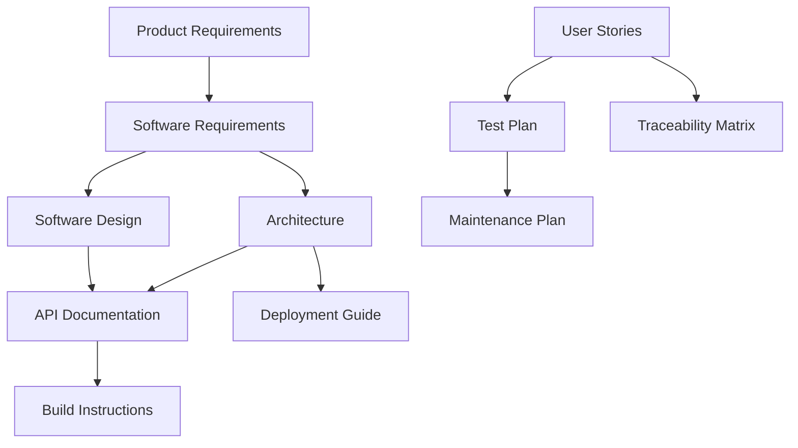

# DevDocAI Documentation Taxonomy

## Document Classification Schema

### Primary Categories

#### 01-Requirements
**Purpose**: Define what the system should do
**Audience**: Product Owners, Stakeholders, Development Team
**Types**: PRD, SRS, User Stories, Feature Specifications

#### 02-Architecture
**Purpose**: Define how the system is built
**Audience**: Architects, Senior Developers, Technical Leads
**Types**: Architecture Documents, Design Documents, Mockups, Diagrams

#### 03-Specifications
**Purpose**: Define technical interfaces and contracts
**Audience**: Developers, Integration Partners
**Types**: API Specs, Data Models, Interface Contracts, Schemas

#### 04-Deployment
**Purpose**: Enable system deployment and operations
**Audience**: DevOps, System Administrators, Release Managers
**Types**: Installation Guides, Build Instructions, Configuration, CI/CD

#### 05-Testing
**Purpose**: Ensure system quality
**Audience**: QA Engineers, Test Automation Engineers
**Types**: Test Plans, Test Strategies, QA Documentation, Benchmarks

#### 06-User-Guides
**Purpose**: Enable end-user success
**Audience**: End Users, Support Teams, Training Teams
**Types**: User Manuals, Tutorials, FAQs, Troubleshooting Guides

#### Meta
**Purpose**: Govern documentation process
**Audience**: Documentation Team, Project Managers
**Types**: Standards, Templates, Style Guides, Governance

## Document Metadata Schema

### Required Fields
```yaml
document_id: "DOC-[CATEGORY]-[TYPE]-[VERSION]"
title: "Document Title"
version: "3.5.0"
status: "Draft|Review|Active|Deprecated"
category: "01-requirements|02-architecture|03-specifications|04-deployment|05-testing|06-user-guides|meta"
type: "prd|srs|architecture|api|guide|manual|plan"
```

### Extended Fields
```yaml
created_date: "YYYY-MM-DD"
last_updated: "YYYY-MM-DD"
authors:
  - name: "Author Name"
    role: "Role"
reviewers:
  - name: "Reviewer Name"
    role: "Role"
stakeholders:
  - name: "Stakeholder Name"
    role: "Role"
complexity_level: "Basic|Intermediate|Advanced"
reading_time: "X minutes"
prerequisites:
  - "Document ID or Title"
related_documents:
  - document_id: "DOC-ID"
    relationship: "extends|implements|references|supersedes"
keywords:
  - "keyword1"
  - "keyword2"
module_mappings:
  - module_id: "M001"
    relevance: "primary|supporting"
```

## Document Registry

### Requirements Documents

| Document ID | Title | Type | Status | Complexity |
|------------|-------|------|--------|------------|
| DOC-REQ-PRD-3.5 | Product Requirements Document | PRD | Active | Intermediate |
| DOC-REQ-SRS-3.5 | Software Requirements Specification | SRS | Active | Advanced |
| DOC-REQ-USR-3.5 | User Stories | User Stories | Active | Basic |

### Architecture Documents

| Document ID | Title | Type | Status | Complexity |
|------------|-------|------|--------|------------|
| DOC-ARCH-SYS-3.5 | System Architecture | Architecture | Active | Advanced |
| DOC-ARCH-SDD-3.5 | Software Design Document | SDD | Active | Advanced |
| DOC-ARCH-MOK-3.5 | UI Mockups & Design | Design | Active | Intermediate |

### Specification Documents

| Document ID | Title | Type | Status | Complexity |
|------------|-------|------|--------|------------|
| DOC-SPEC-API-3.5 | API Documentation | API Spec | Active | Intermediate |
| DOC-SPEC-TRC-3.5 | Traceability Matrix | Matrix | Active | Intermediate |

### Deployment Documents

| Document ID | Title | Type | Status | Complexity |
|------------|-------|------|--------|------------|
| DOC-DEP-BLD-3.5 | Build Instructions | Build Guide | Active | Basic |
| DOC-DEP-INS-3.5 | Deployment & Installation Guide | Deploy Guide | Active | Intermediate |
| DOC-DEP-MNT-3.5 | Maintenance Plan | Maintenance | Active | Intermediate |
| DOC-DEP-REL-3.5 | Release Notes Template | Template | Active | Basic |

### Testing Documents

| Document ID | Title | Type | Status | Complexity |
|------------|-------|------|--------|------------|
| DOC-TST-PLN-3.5 | Test Plan | Test Plan | Active | Intermediate |

### User Guide Documents

| Document ID | Title | Type | Status | Complexity |
|------------|-------|------|--------|------------|
| DOC-USR-MAN-3.5 | User Manual | Manual | Active | Basic |
| DOC-USR-DOC-3.5 | User Documentation | User Docs | Active | Basic |

### Meta Documents

| Document ID | Title | Type | Status | Complexity |
|------------|-------|------|--------|------------|
| DOC-META-SCM-3.5 | Software Configuration Management Plan | SCMP | Active | Advanced |

## Relationship Matrix

### Document Dependencies



## Tagging System

### Technical Tags
- `backend`, `frontend`, `database`, `api`, `security`, `performance`
- `authentication`, `authorization`, `encryption`, `validation`
- `microservices`, `monolithic`, `serverless`, `cloud-native`

### Process Tags
- `agile`, `scrum`, `waterfall`, `devops`, `ci-cd`
- `testing`, `qa`, `automation`, `manual-testing`
- `deployment`, `installation`, `configuration`, `maintenance`

### Audience Tags
- `developer`, `architect`, `qa-engineer`, `devops`
- `product-owner`, `stakeholder`, `end-user`, `administrator`
- `beginner`, `intermediate`, `advanced`, `expert`

### Module Tags
- `M001-config`, `M002-storage`, `M003-miair`, `M004-generator`
- `M005-tracking`, `M006-suite`, `M007-review`, `M008-llm`
- `M009-enhancement`, `M010-sbom`, `M011-batch`, `M012-version`
- `M013-marketplace`

## Search Patterns

### By Role
- **Developer**: `category:02-architecture OR category:03-specifications`
- **QA**: `category:05-testing OR type:traceability`
- **DevOps**: `category:04-deployment`
- **User**: `category:06-user-guides`

### By Module
- **Module M003 MIAIR**: `module:M003 OR keywords:miair`
- **Module M008 LLM**: `module:M008 OR keywords:llm`

### By Complexity
- **Beginner**: `complexity:Basic`
- **Advanced**: `complexity:Advanced OR complexity:Intermediate`

### By Status
- **Current**: `status:Active`
- **In Progress**: `status:Draft OR status:Review`

## Document Lifecycle

1. **Draft** → Initial creation, work in progress
2. **Review** → Under review by stakeholders
3. **Active** → Approved and current
4. **Deprecated** → Outdated but kept for reference
5. **Archived** → No longer relevant, stored offline

## Quality Metrics

### Document Quality Indicators
- **Completeness**: All required sections present
- **Accuracy**: Technical correctness verified
- **Clarity**: Readability score > 60
- **Currency**: Updated within last 90 days
- **Consistency**: Follows style guide
- **Coverage**: Addresses all requirements

### Documentation Health Score
- **Green (90-100%)**: Excellent documentation
- **Yellow (70-89%)**: Good documentation, minor improvements needed
- **Orange (50-69%)**: Fair documentation, significant improvements needed
- **Red (<50%)**: Poor documentation, major revision required