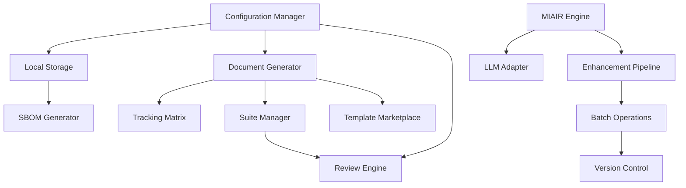

# DevDocAI Module Definitions

## Module Architecture Overview

DevDocAI v3.5.0 is built on a modular component system with 13 core modules organized in 4 implementation phases.

## Core Modules (M001-M013)

### Phase 1 - Foundation Modules

#### M001: Configuration Manager
**Purpose**: Memory mode detection and adaptive configuration management
**Status**: Active
**Documentation**:
- Primary: [System Architecture](../02-architecture/devdocai-v3.5-architecture.md)
- Supporting: [API Documentation](../03-specifications/devdocai-v3.5-api-documentation.md)
**Key Features**:
- Automatic memory mode detection
- Configuration file management (.devdocai.yml)
- Environment variable handling
- Performance optimization settings

#### M002: Local Storage System
**Purpose**: Encrypted file operations with Argon2id security
**Status**: Active
**Documentation**:
- Primary: [Software Design Document](../02-architecture/devdocai-v3.5-sdd.md)
- Supporting: [API Documentation](../03-specifications/devdocai-v3.5-api-documentation.md)
**Key Features**:
- Argon2id encryption
- Secure key management
- File system abstraction
- Cache management

#### M004: Document Generator
**Purpose**: Generate 40+ document types from templates
**Status**: Active
**Documentation**:
- Primary: [Software Design Document](../02-architecture/devdocai-v3.5-sdd.md)
- Supporting: [User Manual](../06-user-guides/devdocai-v3.5-user-manual.md)
**Key Features**:
- Template engine
- Document type registry
- Variable substitution
- Format conversion

#### M005: Tracking Matrix
**Purpose**: Visual suite management dashboard
**Status**: Active
**Documentation**:
- Primary: [Traceability Matrix](../03-specifications/devdocai-v3.5-traceability-matrix.md)
- Supporting: [User Stories](../01-requirements/devdocai-v3.5-user-stories.md)
**Key Features**:
- Real-time progress tracking
- Document status visualization
- Quality metrics display
- Dependency mapping

#### M006: Suite Manager
**Purpose**: Document consistency enforcement
**Status**: Active
**Documentation**:
- Primary: [System Architecture](../02-architecture/devdocai-v3.5-architecture.md)
- Supporting: [API Documentation](../03-specifications/devdocai-v3.5-api-documentation.md)
**Key Features**:
- Cross-document validation
- Consistency checking
- Version synchronization
- Suite-wide operations

#### M007: Review Engine
**Purpose**: Multi-dimensional quality analysis
**Status**: Active
**Documentation**:
- Primary: [Software Design Document](../02-architecture/devdocai-v3.5-sdd.md)
- Supporting: [Test Plan](../05-testing/devdocai-v3.5-test-plan.md)
**Key Features**:
- Quality gate enforcement (85%)
- Four-dimension analysis
- Automated scoring
- Improvement suggestions

### Phase 2 - Intelligence Modules

#### M003: MIAIR Engine
**Purpose**: Meta-Iterative AI Refinement with entropy optimization
**Status**: Active
**Documentation**:
- Primary: [System Architecture](../02-architecture/devdocai-v3.5-architecture.md)
- Supporting: [Test Plan](../05-testing/devdocai-v3.5-test-plan.md)
**Key Features**:
- Multi-LLM synthesis
- Entropy optimization
- Quality improvement (60-75%)
- Iterative refinement

#### M008: LLM Adapter
**Purpose**: Multi-provider integration with cost management
**Status**: Active
**Documentation**:
- Primary: [System Architecture](../02-architecture/devdocai-v3.5-architecture.md)
- Supporting: [API Documentation](../03-specifications/devdocai-v3.5-api-documentation.md)
**Key Features**:
- Claude integration
- ChatGPT integration
- Gemini integration
- Cost tracking and optimization

#### M009: Enhancement Pipeline
**Purpose**: Progressive quality improvement workflow
**Status**: Active
**Documentation**:
- Primary: [Software Design Document](../02-architecture/devdocai-v3.5-sdd.md)
- Supporting: [User Manual](../06-user-guides/devdocai-v3.5-user-manual.md)
**Key Features**:
- Staged enhancement
- Quality progression tracking
- Rollback capability
- Performance optimization

#### M011: Batch Operations
**Purpose**: Parallel processing with resource optimization
**Status**: Active
**Documentation**:
- Primary: [Software Design Document](../02-architecture/devdocai-v3.5-sdd.md)
- Supporting: [API Documentation](../03-specifications/devdocai-v3.5-api-documentation.md)
**Key Features**:
- Parallel document processing
- Resource pooling
- Queue management
- Progress tracking

#### M012: Version Control
**Purpose**: Git integration with auto-commit
**Status**: Active
**Documentation**:
- Primary: [SCMP](../meta/devdocai-v3.5-scmp.md)
- Supporting: [Maintenance Plan](../04-deployment/devdocai-v3.5-maintenance-plan.md)
**Key Features**:
- Git integration
- Auto-commit functionality
- Branch management
- Diff visualization

### Phase 3 - Advanced Modules

#### M010: SBOM Generator
**Purpose**: SPDX 2.3 and CycloneDX 1.4 compliance
**Status**: Active
**Documentation**:
- Primary: [System Architecture](../02-architecture/devdocai-v3.5-architecture.md)
- Supporting: [Deployment Guide](../04-deployment/devdocai-v3.5-deployment-installation-guide.md)
**Key Features**:
- SPDX 2.3 format support
- CycloneDX 1.4 format support
- Dependency analysis
- License detection

#### M013: Template Marketplace
**Purpose**: Community template sharing
**Status**: Active
**Documentation**:
- Primary: [System Architecture](../02-architecture/devdocai-v3.5-architecture.md)
- Supporting: [User Manual](../06-user-guides/devdocai-v3.5-user-manual.md)
**Key Features**:
- Template discovery
- Digital signatures (Ed25519)
- Version management
- Rating system

## Module Dependencies



## Module Implementation Status

| Phase | Modules | Status | Completion |
|-------|---------|--------|------------|
| Phase 1 | M001, M002, M004-M007 | Active | 100% |
| Phase 2 | M003, M008-M009, M011-M012 | Active | 100% |
| Phase 3 | M010, M013 | Active | 100% |
| Phase 4 | Future modules | Planned | 0% |

## Module Communication

### Inter-Module APIs
- **REST**: For external communication
- **Events**: For async operations
- **Direct**: For synchronous calls
- **Message Queue**: For batch operations

### Data Flow
1. Configuration (M001) initializes system
2. Storage (M002) provides persistence
3. Generator (M004) creates documents
4. MIAIR (M003) enhances quality
5. Review (M007) validates output
6. Suite Manager (M006) ensures consistency

## Module Configuration

Each module has its own configuration section in `.devdocai.yml`:

```yaml
modules:
  M001:
    enabled: true
    memory_mode: auto
  M002:
    encryption: argon2id
    cache_size: 100MB
  M003:
    iterations: 3
    quality_target: 0.85
  M008:
    providers:
      - claude
      - chatgpt
      - gemini
```

## Module Testing

Each module has dedicated test coverage:
- Unit tests: `tests/modules/M###/`
- Integration tests: `tests/integration/`
- Performance tests: `tests/performance/`
- Security tests: `tests/security/`

## Module Documentation Standards

All modules follow consistent documentation:
1. Purpose and scope definition
2. API specification
3. Configuration options
4. Usage examples
5. Testing procedures
6. Performance metrics
7. Security considerations

## Future Modules (Phase 4)

### Planned Enhancements
- **M014**: Real-time Collaboration
- **M015**: Cloud Sync Service
- **M016**: Analytics Dashboard
- **M017**: Mobile Companion
- **M018**: AI Training Pipeline

## Module Governance

### Ownership
Each module has designated:
- Technical Owner
- Documentation Owner
- Test Owner

### Review Process
- Design review before implementation
- Code review for all changes
- Documentation review for updates
- Performance review quarterly

### Deprecation Policy
- 6-month deprecation notice
- Migration guide provided
- Backward compatibility maintained
- Sunset date clearly communicated